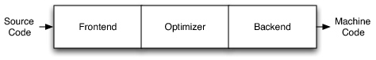
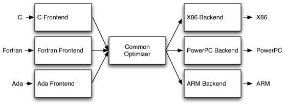
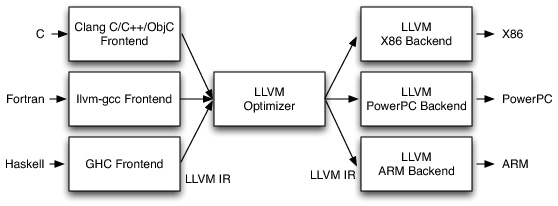
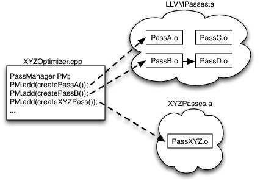
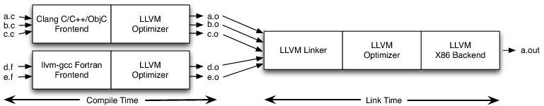
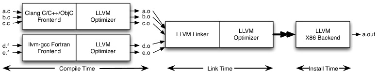

# 第一章 LLVM

## 认识 LLVM

相信你对 Clang 可能早有耳闻，并且知道 Clang 是 Xcode 默认采用的编译器，否则你也不会来阅读本书了。你可能急不可待的希望了解与 Clang 相关的一切，这个每天伴随着你工作的软件。不过遗憾的是我们不得不先从 LLVM 谈起，因为 Clang 其实只是庞大项目 LLVM 的并非核心的一小部分而已。

尽管 LLVM 这个名字听起来和传统意义上的虚拟机有一点关系，而你大可不必过分在意对名字本身的理解。实际上 LLVM 项目是一系列模块、可复用编译器和工具链的集合。

LLVM 开始于伊利诺伊州立大学的一个研究项目，该项目的目标是开发一个基于 SSA 的现代编译器，用以支持任意编程语言的静态和动态编译。随后该项目逐步发展成了一个庞大的项目集合，囊括了诸多子项目，这些子项目被广泛的用于商业、开源和学学术究领域。

介绍一些主要的子项目：

- LLVM Core 即 LLVM 的核心库，主要是围绕 LLVM 中间代码的一些工具，它提供了一个“源”和“目标”无关的优化器和几乎所有主流 CPU 类型的代码（机器码）生成器。该库的文档很完善，据此你可以轻松的基于 LLVM 开发一门编程语言的编译器，并将 LLVM 作为该编译器的优化器和代码生成器。

- Clang 是 LLVM 自带的 C/C++/Objective-C 编译器，其目标是：具有超快的编译速度，例如Clang 以 debug 方式编译 Objective-C 的速度比 GCC 快了3倍；提供极有价值的错误和告警消息；为构建源代码级别的工具提供基础支持，例如 Clang Static Analyzer，一个自动寻找 bug 的工具，就是此类工具的一个很好范例。

- LLDB 是 LLVM 自带的调试器，它是基于 Clang 的抽象语法数和表达式解析器、LLVM JIT、LLVM 反汇编器等工具开发的，其运行速度和内存性能方面的表现都远胜于 GDB。

- libc++和 libc++ ABI 是 C++ 标准库的一个实现，与标准一致，且性能很高，全面支持 C++11。开发这个库的原因是 LLVM 与 C++ 标准库的开源协议存在不兼容。

- compiler-rt 为代码生成器提供了一些中间代码指令的实现，这些指令通常是目标机器没有直接对应的，例如在32位机器上将 double 转换为 unsigned integer 类型。此外该库还为一些动态测试工具提供了运行时实现，例如 AddressSanitinzer、ThreadSanitizer、MemorySanitizer 和 DataFlowSanitizer 等。

- 其他一些诸如 OpenMP、polly、libclc、klee、SAFECode、lld 等项目，也都在各自领域发挥着巨大作用，再次不再一一赘述，有兴趣的读者可以自行查阅相关文档。

除了以上官方子项目以为，还有众多非官方的不同目的的项目也用到了 LLVM。借助这些项目你可以使用 LLVM 编译 Ruby、Python、Hashkell、Java、D、PHP、Pure、Lua 和其他很多不同的编程语言。LLVM 的主要优势在于其功能丰富，且灵活性和可复用性好。所以才能具有如此广泛的使用场景，小到嵌入式语言（例如 Lua）的轻量级 JIT 编译工作，大到编译大型机语言 Fortran 代码，都可以见到 LLVM 的身影。

作为如此庞大的成功的开源项目，通常都离不开一个开放友好的交流社区，LLVM 也不例外。在这里聚集了众多构建对低水平工具感兴趣的开发者。如果你有兴趣参与项目，可以浏览 LLVM 的博客了解最新动向，注册 LLVM 开发者邮件列表与开发者讨论，你还可以为项目提交补丁，具体的操作方式需要关注官方网站的开发者策略介绍。

## LLVM 架构基本认识

### 经典编译器设计

传统的静态编译器，例如大多数的C编译器，都遵循着三段式设计，所谓的三段分别是前端、优化器、后端（如图3.1）。前端解析源代码，检查错误，进而构建一个特定语言的抽象语法树（AST）来表示输入源代码。AST 可能会接着被转换成另一种用来做性能优化的中间代码，优化器和后端都会基于这种代码作业。



优化器的作用是对中间代码进行多种多样的变换，进而提升代码的运行时效率，例如减少无用的计算。优化的过程通常不依赖编程语言和编译目标。后端（通常也称为代码生成器）的作用是将中间代码映射成目标指令集。此外后端还需要充分利用特定的机器架构的优势生成更高效的代码。后端通常包括指令选择、寄存器申请、指令安排。

这种模型同样很好的应用在中间表示和JIT技术领域，Java 虚拟机也是这种模型的实现，其使用Java字节码作为前端和优化器的接口。

### 三段式设计的优势

这种经典设计的最大优势体现在多语言和多架构的支持上，由于架构上的解耦，支持多种编程语言的前端和支持多种架构的后端可以完全复用同一个优化器。因此，当你需要支持一门新的语言的时候，仅仅需要开发这个新的前端，优化器和后端可以被复用，而不需要开发一整个编译器。类似的，当你需要多支持一种CPU架构，仅仅需要开发这个架构的后端。



这种架构的设计的另一个巨大优势在于，一个编译器社区可以服务多种语言的开发者，所谓众人拾材火焰高嘛，这样就有了更广泛的交流和贡献。你可以看到GCC这类集成编译器的优化程度远高于专用编译器FreePASCAL。

### 三段式的现实应用

尽管三段式设计看上去如此美好，但在 LLVM 诞生前，其实也只停留在教科书水平，实际上并没有完全得到实践。你可以发现 Perl、Python、Ruby 和 Java 的编译器之间并没有共享任何代码。类似的像 Glasgow Haskell Compiler 和 FreeBASIC 这类可重定目标的项目，他们也仅仅支持特定的一种源语言。另外被广泛用于图像处理、正则表达式、显卡驱动和其他需要 CPU 加强工作的领域的 JIT 技术，也存在类似的现象，它们被各自开发而没有任何重用。

当然，我们也看到了三个被津津乐道的三个成功故事，虽然它们仅仅是部分采用了这种分离式的设计思想。

首先是 Java 和 .NET 虚拟机，这些系统提供了 JIT 编译器、运行时支持和一个设计良好的字节码格式。于是任何语言，只要能够被编译成符合规范的字节码，就可以运行在这个性能良好的虚拟机上了。不过这样的代价也不小，在运行时的选择上就非常局限，在 JIT 编译、垃圾回收和特定对象模型等方面，都严重受限。因此这些语言仅仅是表面看起来不太一样，实际上的运行效果几乎无差。

第二个成功的故事，听起来并不那么靠谱，但确实有人这么干：先把源语言转成 C 语言，再扔给现成的 C 编译器。这样可以复用整个 C 编译器的各个组件，而且容易理解，易于实现和维护，是一个非常取巧的办法！据说早期的 C++ 就是这么干的，还有 FaceBook 的 HipHop for PHP 也是类似的，它先把 PHP 转成了 C++ 再编译。听起来很美好啊，但是别急，这样的问题也是很大。如果你想实现一个高效的异常处理机制，或者想单步调试代码，就会显得困难重重，而且编译速度也相对不高，此外语言设计上也严重受限于 C 语言（或者其他目标语言）。

最后，不得不提大名鼎鼎的 GCC 了。GCC 支持了许多前端和后端，并且有着广泛的贡献者社区。最开始 GCC 仅仅是 C 编译器，不过后来许多黑客把更多的语言支持加了进去。怎么样？听起来 GCC 就是三段式的完美践行者了呀！不过你会发现，近些年来，GCC 的发展明显很慢，为什么呢？因为 GCC 的设计本质上还是一整个应用，组件拆分的并不彻底。举个例子，如果我们想把 GCC 当作一个组件嵌入到别的应用里去来实现 JIT 编译过程，或者想仅仅拿 GCC 的一部分代码出来用而不是拉下整个工程，就完全做不到。当人们想使用 GCC 的 C++ 前端来开发文档生成器、代码索引、重构以及静态分析工具，就必须把 GCC 当作一个独立应用来生成 XML 文档再写程序去解析，或者用直接在 GCC 中插入代码的形式。

GCC 组件不能作为可重用的库被重用的原因包括滥用全局变量、常量没有得到严格限制、设计不佳的数据结构、宏的滥用等问题。更加难以解决的是固有架构的设计问题，受限于当时那个年代，设计者没有长远的考虑。尤其是 GCC 的分层设计，后端通过走访前端语法树来生成调试信息，而前端负责生成后端数据结构，另外整个编译器依赖命令行参数构建的全局数据结构。

### LLVM 的三段式实现

我们看到在 LLVM 诞生之前，并没有哪一个编译器是真正按照三段式设计的，而 LLVM 是第一个三段式模型的践行者，因为它从一开始就是按照这个思想设计的。

在一个基于 LLVM 的编译器中，前端的作用非常明确，负责对源代码进行解析、校验和诊断错误，然后输出中间语言（Intermedia Representation），我们称之为 LLVM IR（这一转换过程通常会借助抽象语法树）。IR 通常（但不必须）会经过多级优化来提升代码的性能，当然每一次的输出依然是 IR 的形式。最后把 IR 交给后端，即代码生成器，产生出不同架构所需的机器代码。



尽管 IR 并不是本书的重点，不过作者自称 IR 是 LLVM 的最大亮点，也是 LLVM 成功的最重要因素，所以我们这里有必要花一点时间了解一下。

先来看一段 .ll 文件：

```ll
define i32 @add1(i32 %a, i32 %b) {
entry:
  %tmp1 = add i32 %a, %b
  ret i32 %tmp1
}

define i32 @add2(i32 %a, i32 %b) {
entry:
  %tmp1 = icmp eq i32 %a, 0
  br i1 %tmp1, label %done, label %recurse

recurse:
  %tmp2 = sub i32 %a, 1
  %tmp3 = add i32 %b, 1
  %tmp4 = call i32 @add2(i32 %tmp2, i32 %tmp3)
  ret i32 %tmp4

done:
  ret i32 %b
}
```

代码结构有些像 C 语言，单看每一条语句又神似汇编。尽管这可能是你第一次见过 IR，我相信你一定能大致看出一些逻辑吧。下面是对应的 C 代码：

```ll
unsigned add1(unsigned a, unsigned b) {
  return a+b;
}

// Perhaps not the most efficient way to add two numbers.
unsigned add2(unsigned a, unsigned b) {
  if (a == 0) return b;
  return add2(a-1, b+1);
}
```

LLVM IR 是一种低水平的类似 RISC（精简指令集）的虚拟指令集。与 RISC 类似，它支持线性简单指令序列，例如加、减、比较、分支等。不过与 RISC 的一个明显不同之处在于，RISC 指令是没有返回值的，输入和运算结果是合用了一个寄存器的。而 IR 是不会修改输入寄存器的，运算结果必须放在另一个不同的寄存器中。

与 RISC 不同，LLVM IR 有数据类型的概念，例如这里的 i32 是表示 32-bit integer，由此可以派生出 i32** 表示 i32 的指针类型。函数调用使用 call 指令，不过用法也不同，IR 要求带上完整的参数说明，而不仅仅是一个符号地址。函数返回使用 ret 指令，但所返回的值和类型是放在 ret 指令后面的，而非隐式约定在某个寄存器中。

与 RISC 另一个巨大的不同在于寄存器的使用，我们知道某一架构的 CPU 作为一种物理硬件，是有明确数量寄存器的，因此寄存器的名称也是预先定义好的，不可更改。而在 IR 中，寄存器的名称并不确定，数量上也没有限制，这就很类似高级语言中的临时变量，随用随取，取之不尽，用之不竭。

LLVM IR 不仅是刚刚所看到的一种对人类友好的语言的存在，LLVM IR 实际上存在三种形式的表示方式：

1. 如上的文本格式，也是人类可理解的形式，通常存储为 .ll 文件
1. 在内存中的数据结构，这种形式可以在优化时被随时修改
1. p存储时使用的格式，解析起来高效且占用更少的磁盘，通常存储为 .bc 文件

LLVM 提供了 .ll 和 .bc 之间相互转换的工具，llvm-as 用户 把 .ll 转换成 .bc，llvm-dis 则相反。

编译器的中间表示对优化器来说至关重要，有了中间表示的存在，优化器不再需要面对各种不同的编程语言，也不需要考虑输出成不同架构的代码，而只要专心做好程序优化本身即可。当然中间表示的设计也有相当大的难度，即要考虑到便于被前端输出，又要兼顾后端容易由此生成真实的机器代码。也是因此，我们看到了 LLVM IR 即像高级语言，又像汇编，这种非驴非马的形式。

由于 LLVM IR 的良好设计，它成为了优化器唯一的接口，因此造就了三段式模型的完美实现。相比之下，GIMPLE（GCC的中间表示）并不能独立完整的表达，当代码生成器产生 DWARF 调试信息的时候，必须回溯到前端，基于源代码水平的树才能做到。GIMPLE 也没有类似 LLVM IR 的三种表示形式，仅有内存中的数据结构，因此前端就无法脱离 GCC 而独立存在，后端也一样，也无法随时把中间表示保存起来或打印出来阅读。

## LLVM 是编译器吗？

本书谈到这里，相信你对 LLVM 已经有了初步的认识。而我们在这里提出这样初级的问题，你可能会说：“LLVM 就是一种编译器啊，这有什么疑问吗？”。其实我们仔细回想，LLVM 真的是一种编译器吗？

其实 LLVM 一种语言都无法编译，LLVM 仅仅是一个编译器框架，而非具体的编译器。就好像我们说 Ruby on Rails 是一种 web 框架，而非一个网站。相比而言 GCC 是一个命令行工具，JVM 是一个虚拟机，而 LLVM 是一系列库的集合。

### 优化器开发

作为 LLVM 的核心组件，LLVM 优化器同样具有良好的设计，它读入 LLVM IR，然后产生新的 LLVM IR，当然通常新产生的 IR 具有更高的执行效率。LLVM 优化器并不是一整个程序，而是由一系列 Pass （一般翻译为“趟”）串联起来组成，有点类似信号处理里的高通/低通滤波器的概念，每一个 Pass 的输出会作为下一个 Pass 的输入，这样一个一个串起来。每个 Pass 通常只做一个单项优化，它们独立存在，使用的时候会根据指定的优化水平搭配出不同的组合，例如 Debug 时使用 -O0 表示不优化，这意味着没有使用任何 Pass，Release 时使用 -O3 会组合出 67 个 pass 进行深度优化（LLVM 2.8 版本）。

Pass 由 C++ 语言编写，通常是一个独立文件，存在一个由基类 Pass 派生的子类，这个子类要复写一个固定的方法 runOnFunction，并被调用执行优化过程，我们来看一个例子。

```cpp
namespace {
  class Hello : public FunctionPass {
  public:
    // Print out the names of functions in the LLVM IR being optimized.
    virtual bool runOnFunction(Function &F) {
      cerr << "Hello: " << F.getName() << "\n";
      return false;
    }
  };
}

FunctionPass *createHelloPass() { return new Hello(); }
```

LLVM 中默认提供了几十个 Pass，它们的代码风格类似，每个 Pass 会被编译成一个 .o 文件，然后被合成到一个 .a 文件中去。Pass 被设计成松散的关系，它们通常相互独立无依赖。当然也允许依赖的存在，但这种依赖要求明确声明。PassManager 会根据这种依赖信息去配置 Pass 来满足依赖的要求，有点类似 apt-get 安装软件包的过程。

这样的设计对于一个可定制的优化器来说至关重要。当我们想要开发一个专项的编译器，例如图片处理的 JIT 编译器，这与 C 编译器面临的情况大相径庭，如果死板的使用固定的优化手段，不仅可能达不到最佳的优化效果（因为 JIT 更加依赖运行时环境），还会造成时间的无端浪费（而这对于一个 JIT 编译器来说非常关键）。于是这样的设计就发挥价值了，首先我们可以轻松的裁剪掉那些用不到的优化单元，还可以轻松的加入自行编写的专项优化单元来实现更好的效果。




图中举例对以上描述做一个总结，XYZ优化器先是从 LLVM 自带的优化器集合 LLVMPasses 中挑选了两个 Pass A 和 B，而 B 依赖 D，因为 PassManager 预先了解了这一信息，于是自动的把 D 也加入到了 Pass 组中。最后从 XYZPasses 中选择了一个自定义的专项优化器。合起来组成了自定义优化器 XYZOptimizer。

这种设计的好处不仅体现在组建优化器上，它还大大简化了优化器的开发。作为一个优化单元 Pass 只需要了解和关注特定的优化项，而不用了解整个系统是如何组合起来工作的。这一点笔者在开发的时候体会非常深刻，因为整个 LLVM 项目太过庞大，如果不是这种良好的设计，会让很多没有完整研究过 LLVM 的人无从下手。这就好比直接去修改 Firefox 的功能比开发 Firefox 的一个扩展要难的多的多。

### 优化器测试

编译器非常复杂，质量特别重要，所以编译器的测试需要极其严格。当修改了优化器的某个 bug 后，一定需要回归测试来保证 bug 是否真的被修复且没有引入新的 bug。传统的编译器，例如 GCC，通常是采用了全链路测试的方式，即编写测试所用的 .c 文件，运行整个编译器，检查结果是否正确。

但是由于编译器如此庞大，由很多个部分组成，一旦前端逻辑修改，可能会导致之前的测试用例无法覆盖全部的情况。这就好比你玩大富翁，任一挑所掷的骰子的不同都会导致后面的路径完全不同。

GCC 所用的这种方式其实可以理解为集成测试，我们知道软件光靠集成测试是不够的，为了对每个细小组件进行全覆盖测试，应该使用单元测试来完成。但由于 GCC 的设计所限，根本无法实施单元测试。而 LLVM 的模块化设计可以解决这一难题，LLVM IR 可以在任意时间从磁盘上载入，然后只执行某一个特定的优化器 pass 即可针对性的开展单元测试了。

```ll
; RUN: opt < %s -constprop -S | FileCheck %s
define i32 @test() {
  %A = add i32 4, 5
  ret i32 %A
  ; CHECK: @test()
  ; CHECK: ret i32 9
}
```

这是一个用于测试 add 指令的常量优化（把 4 + 5 优化成 9）的单元测试用例，它使用了两个命令行工具 opt 和 FileCheck。其中 opt 是一个 pass 管理器，用于连接标准 pass 和指定的 pass，然后输出结果，FileCheck 会检查输入文件的合法性。

### 代码生成器

LLVM 的代码生成器负责将 IR 翻译成特定目标的机器代码，例如 针对 Intel 的 X86 架构，针对移动终端使用的 ARM 架构（ARM 还分版本）。这些架构的代码生成器通常来说是完全相互独立的，需要各自独立开发，没有多少可以复用的部分。不过其实不同目标的代码生成器其实所面临的问题也都是类似的，不是吗？例如：它们都需要给寄存器赋值（尽管各个架构的寄存器名称和数量不同），还有它们的数字运算法也是一样的。

根据这个思想，LLVM 把代码生成问题分解到了多个独立的 pass 里，它们分别是：instruction selection、register allocation、scheduling、code layout optmization 和 assembly emission。同时 LLVM 还内置了许多默认的 pass，当开发某个目标的代码生成器时，可以从这些内置 pass 中选择使用，也可以用自己开发的特定实现替代默认实现。例如 X86 的寄存器数量很少，而 PowerPC 有很多寄存器，于是他们使用了不同的scheduler，但其他部分则采用了默认实现，于是就不需要完整的开发全部的代码生成器，在此我们再次看到了 LLVM 模块化的设计理念。

尽管 LLVM 已经把代码生成过程拆分成了多个细小的部分，企图尽可能找到可以重用的逻辑，可是不管怎么拆分，目标之间的区别依然存在。比如说，一个通用的 register allocator 必须了解每个目标的寄存器名称以及指令和寄存器之间的约束。LLVM 对此的解决方法是，让 pass 支持配置，针对不同的目标给予同一个 pass 不同的配置，就可以得到我们想要的 pass 了。这部分的配置文件由一种特定的声明式语言编写，以 .td 为后缀，被 tblgen 工具解析。

来看一个 .td 文件的例子：

```
def GR32 : RegisterClass<[i32], 32,
  [EAX, ECX, EDX, ESI, EDI, EBX, EBP, ESP,
   R8D, R9D, R10D, R11D, R14D, R15D, R12D, R13D]> { … }
```

这是一行 X86 目标的声明，说的是在这个类里的寄存器可以存放 32-bit integer，它们是32位对齐的，总共是这16个寄存器（分别定义在别的 .td 文件中）。这样的定义可以被特定指令的定义部分引用到，例如以下是一个32-bit 寄存器取补码的指令定义：

```
let Constraints = "$src = $dst" in
def NOT32r : I<0xF7, MRM2r,
               (outs GR32:$dst), (ins GR32:$src),
               "not{l}\t$dst",
               [(set GR32:$dst, (not GR32:$src))]>;
```

这条定义比较复杂，我们在此不深究。简单看一下可以大致了解到，这里的 $src 和 $dst 两个变量被定义为 GR32，也就是前面定义的一类寄存器了。

### bitcode

苹果的 IDE Xcode 中默认开启了一个编译选项 enable bitcode，这项功能首次在 WWDC 上被公布的时候，由于讲演者的含糊其辞引起了不少开发者的误解，以为此选项与软件包瘦身有很大关系。

其实不然，软件包瘦身主要是指 App Store 会针对不同设备下发特定包含目标机器代码的可执行文件（苹果后台程序先分离多个目标的代码，再分别生成多个仅具有单一目标代码的可执行文件）和特定缩放比例的图片资源（为不同分辨率的设备准备的 @1x、@2x和@3x 图片）。而 enable bitcode 是指在 Xcode 在编译的时候不会完整的执行全部的编译过程，而只生成 IR 就结束了，等软件包提交到苹果服务器以后，再由苹果的编译器完成剩下的编译步骤。而这一过程是如何实现的呢？

前文已经提到了，LLVM 的中间表示 IR 可以完整的无损的表示这个阶段的编译结果，IR 可以以不同的形态存在，可以随时保存到磁盘上，于是在而后的任意时刻都可以重新读取 IR 再继续完成其他的编译步骤。

由于在不同的时段编译器所了解的信息是不同的，例如编译时段只知道单个模块（例如 .c 文件）的情况，而在链接阶段就可以了解全部模块的情况。我们可以在编译时段做一部分通用的优化，在链接时段再做一部分优化，例如把一些函数 inline 化，删除一些无用代码等。



甚至还可以像苹果这样，在预安装阶段再进行一次优化并生成机器代码。因为在编译和链接时段只能针对某一类目标（例如 X86）进行通用的优化，而安装阶段可以针对某一个具体的 CPU 型号（例如 Hashwell）进行更有针对性的优化。



