# 第二章 体验LLVM

## 安装 LLVM

LLVM支持几乎所有主流的操作系统，并且已经成为了一些操作系统的默认编译器，用以替代 GCC。如果你的操作系统默认没有安装 LLVM，最快的安装方法是使用操作系统自带的软件包管理工具来安装，我们以一个全新安装的 Ubuntu 18.04 Desktop 虚拟机为例来看。

### 设置虚拟机

如果你跟笔者一样使用虚拟机作为测试环境，建议你通过 ssh 远程连接到虚拟机中，直接使用虚拟机的图形界面不仅慢，还不便于跟外部主机交互，而用 ssh 操作起来就跟平时使用自己的电脑体验无异了。如果你无法通过外部主机连接到虚拟机，可以修改虚拟机的网络适配器模式，改为网桥模式即可使虚拟机与外部主机处于同一个局域网了。

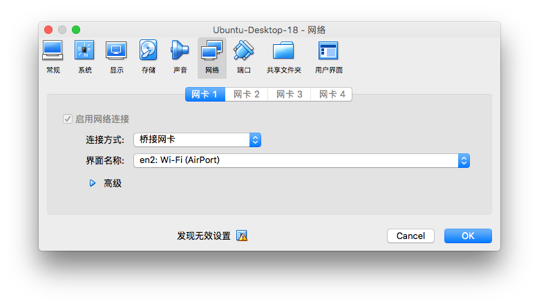

*修改虚拟机网络适配器的连接模式*

这一步操作并不需要切断虚拟机电源，不过有可能需要你重启虚拟机的网络服务。

```bash
$ sudo service networking restart
```

网络环境配置好之后，你可能需要安装 ssh 服务，并启动。

```bash
$ sudo apt install openssh-server
$ sudo service ssh start
```

接下来通过需要获取虚拟机 IP 地址，再使用终端连接，笔者再次就不再赘述了。

### 确认系统当前的编译器

我们知道在命令行环境下，C 编译器有一个别称 cc，不清楚是不是 POSIX 规范还是约定俗成。

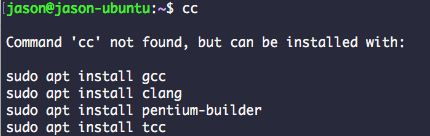

*在终端中输入 cc*

我们看到，这个新装的系统里并没有自带编译环境。在我们执行 cc 命令的时候，系统还非常智能的告诉我们应该如何安装编译器。

Ubuntu 给出了4个建议，其中后两个并不那么为人所知。其中 pentium-build 是 Intel 开发的，tcc 全称叫 Tiny C Compiler，早已不再维护了。

### 使用系统自带软件源安装

按照指引，我们来安装 clang 吧。

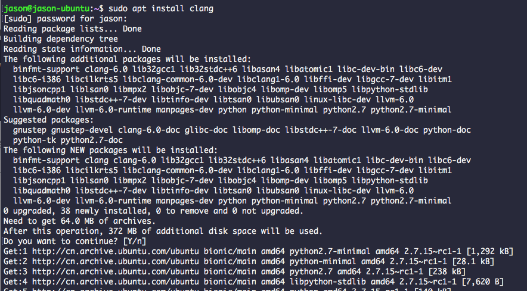

*使用命令行安装clang*

安装过程非常顺利，apt 帮我们把所有依赖的软件包都自动的安装好了。不过你是否好奇，我们本来不是要安装 llvm 吗？为什么我在介绍安装 clang 呢？

前文已经提到，Clang 是 LLVM 的默认前端，而编译过程通常是从前端开始的，所以我们需要安装 clang。另一方面，Clang 其实还承担了一部分非前端的额外工作，即调度整个编译过程，所以 clang 对 llvm 是存在依赖关系的。于是我们安装 clang 的时候就顺带把 llvm 也装好了，这样就省去了逐个安装的麻烦。

从安装过程中我们可以发现除了 clang 以及 clang 依赖的 llvm 相关软件包，还顺便安装了很多其他软件包，例如 libcstdc++，是编译 C++ 代码的时候拿来链接的，而 python 与编译本身无关，只是 llvm 使用了一些 python 脚本来辅助开发。

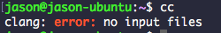

*安装 clang 之后再执行 cc*

检验一下安装结果，此时再次执行 cc 你会发现 clang 跳了出来报错了，可以确定 clang 已经安装好了。

### 版本问题

我们需要关注一下我们安装的 LLVM 是哪个版本的，尽管目前 LLVM 已经相对稳定，但 LLVM 依然是一个非常活跃的项目，每个版本都会进行很多的新特性支持和性能优化，所以我们最好使用当前稳定的最新版作为研究对象。

更为重要的是，本书会介绍基于 LLVM 的开发，需要直接使用 LLVM 内部提供的 C++ API，这一部分的变化是相对频繁的，所以开发过程是要严格控制 LLVM 版本的，否则我们自己编写的代码可能无法在不同版本的 LLVM 上编译，尤其是向更小的版本迁移的时候。

Ubuntu 是一个相对激进的操作系统，使用了 LLVM 当前最新的稳定版本 6.0，其他一些操作系统就不见得会如此激进了，尤其是一些企业级服务器操作系统，它们更加追求稳定而非新特性。有些时候我们也不见得能自由选择操作系统，尤其是在一些企业内部分配的服务器上。

那么此时我们需要一个更加可控的安装方法。有些操作系统的软件包管理工具会提供相对自由的版本选择，但这种方式存在很大的不稳定因素，可能顺带把一些本不该升级的软件包升级了，从而影响到了整个系统的运行。可能这个系统还有其他用途，底层软件包的升级甚至会导致上层应用无法正确运行。

### 编译源代码安装

自行编译源代码的安装方式或许是最自由和安全的了，我们可以精确的控制目标程序的版本、编译选项、扩展、安装路径等。如果我们把自己编译的 LLVM 安装在非系统默认的程序目录下，就不会影响到系统的日常运作了。

获取 LLVM 相关代码的方式有多种，你可以下载压缩包，也可以使用版本控制工具。官方推荐目前依然使用的是 svn 来做版本控制，当然你也可以使用 git，因为官方也提供了 Git 镜像。本书以 git 为例来展开。

首先，我们要了解 LLVM 的代码组织形式。作为一个非常庞大的项目集合，LLVM 使用了整合编译的方式来构建工程，即把非核心项目放在核心项目约定好的目录中再一起构建整个工程。这样做的优点是可以省去复杂的配置过程。你可能担心修改一个非核心的代码就要从头开始编译，其实大可不必，你可以指定编译某一个小的编译目标而非全部构建。

由于 LLVM 是一个大家庭，你可以在整合很多的非核心工程一起编译，不过很多我们目前用不到，所以只下载几个必须的库，其他用到的时候再下载重新编译即可。

```bash
$ mkdir myllvm
$ cd myllvm
$ git clone https://git.llvm.org/git/llvm.git
$ cd llvm/tools
$ git clone https://git.llvm.org/git/clang.git
$ cd clang/tools
$ git clone https://git.llvm.org/git/clang-tools-extra.git extra
$ cd ../../../projects
$ git clone https://git.llvm.org/git/compiler-rt.git
$ git clone https://git.llvm.org/git/libcxx.git
$ git clone https://git.llvm.org/git/libcxxabi.git
$ git clone https://git.llvm.org/git/test-suite.git
$ cd ../../
```

获取了必要的代码之后，接下来开始编译。注意我们不应该在代码目录里面编译，而应该在外部目录编译，因为编译过程会产生的很多文件会跟源码混在一起，我们这里是在源码目录的上一级中建一个专门编译的目录。

```bash
$ mkdir build
$ cd build
$ cmake -G "Unix Makefiles" -DCMAKE_BUILD_TYPE=Release ../llvm
```

我们需要用 CMake 编译工具来构建项目，但是很快可能就会遇到问题。

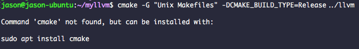

*使用 CMake 构建遇到了问题*

```bash
$ sudo apt install cmake
```

安装完 cmake 之后再次执行上一步操作。从日志中可以看出，cmake 使用了我们前面安装的 clang 6.0 作为 C 和 C++ 编译器。

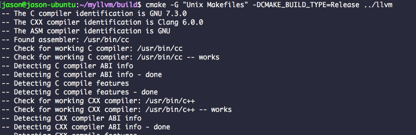

*使用 CMake 构建*

LLVM 的构建过程很复杂，需要用 CMake 这的工具来生成构建工程，这里还没有真正开始编译。由于我们使用了 -G "Unix Makefiles" 选项，意为生成 Makefile，所以我们接下来使用 make 来编译。


```bash
$ make -j4
```

此处的 -j4 表示编译的并发数，具体看所使用的硬件设备，一般来说并发数与处理器核数相当可以最大的提高整体编译速度。如果你不清楚自己的硬件核数，可以通过一下命令来查看处理器信息。

```bash
$ cat /proc/cpuinfo
```

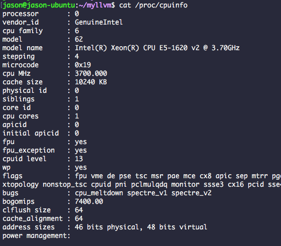

*Linux 下查看处理器信息的方法*

如果你有多个核心，以上命令的输出应该会包含多段图中内容，笔者这里使用的是虚拟机，默认只分配了主机的一个核，为了提高编译速度，可以通过修改虚拟机设置来改变分配核数。

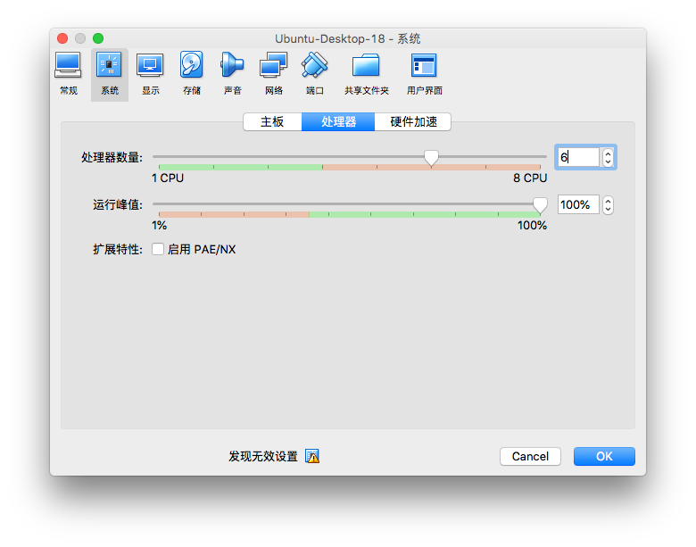

*在 VirtualBox 中修改处理器分配数量*

先关机，完成修改后重新启动并再次查看处理器信息，我们会发现多了几个 processor。

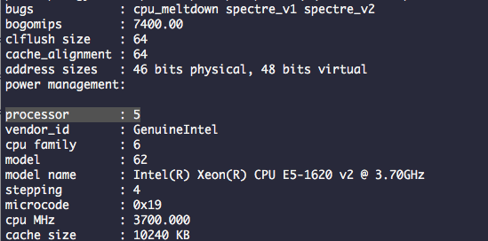

*修改分配后再次查看处理器信息*

现在处理器最大编号到达了5，此时我们有6个核可以用了，我们再次执行编译命令。

```bash
$ make -j6
```

接下来的编译过程一开始看起来一帆风顺，但是没一会儿就结束了，才编译到了10%的进度就报错了。

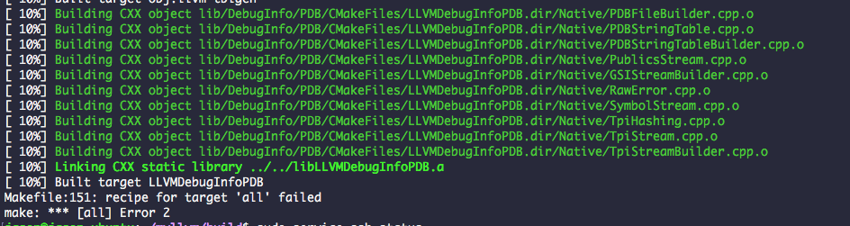

*首次编译出错*

这里看不出来出了什么问题，往前翻编译日志，可以看到一些更详细的错误。

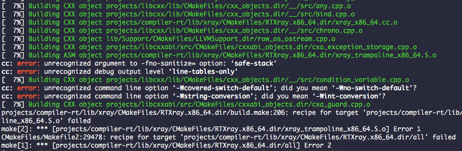

*更详细的编译错误*

这里解释一些为什么编译到7%的时候就已经出错了，后面还在继续编译。还记得前面说到了我们使用了并发编译选项了吧，其中一个编译进程出错了，其他进程还在继续执行呢，所以才会出现这种状况。

我们看到错误说明是：unrecognized argument to -fno-sanitize= option: 'safe-stack' 等。回过头来，我们再看一下前面 cmake 输出的日志里，可以搜到相关的编译参数检测。

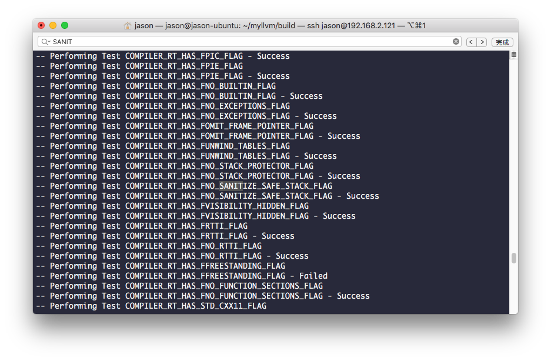

*cmake日志中关于 -fno-sanitize 的检测结果*

遇到这种情况怎么办呢？笔者其实也并无经验，于是再次仔细阅读文档，发现文档中提到另一种构建工具 Ninja，是一种替代 make 的方案，于是就决定一试。

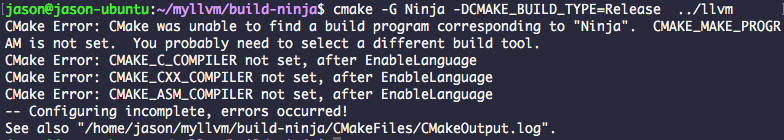

*生成 Ninja 工程的时候出错*

这个错误并不奇怪，因为我们并没有安装 Ninja，Ninja 在不同的系统上名称可能不一样，Ubuntu 的正确安装方式是：

```bash
$ sudo apt install ninja-build
```

接下来重新生成 Ninja 项目，不过这次我们来修改一下安装路径，因为默认安装路径会覆盖系统的 clang。

```bash
$ cmake -G Ninja -DCMAKE_BUILD_TYPE=Release -DCMAKE_INSTALL_PREFIX="/home/jason/myllvm/install-ninja"  ../llvm
```

接下来使用 ninja 而非 make 来构建了，但是很不幸，笔者再次遇到了编译错误。

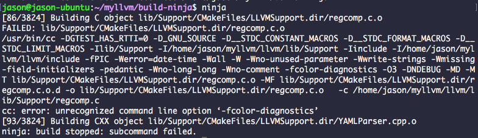

*使用 ninja 编译再次遇到错误*

不过这次遇到的错误有所不同，可以看到是 -fcolor-diagnostics 参数不支持，但笔者通过查阅 clang 文档，发现这个参数早就支持了。

到目前位置，我们分别用 make 和 ninja 两种方式来编译，都遇到了类似的编译参数不支持的问题，这就不禁让笔者怀疑现在用的这个编译器到底是不是前面安装的 clang 6.0 了，我们来验证一下。

首先我们把错误日志里出错的编译命令单独拿出来执行一遍做个验证。

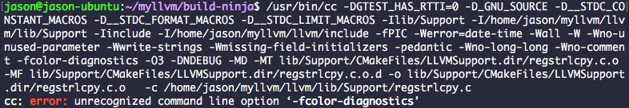

*单独执行出现同样的错误*

那我们不用 /usr/bin/cc，我们显示的使用 /usr/bin/clang 再试一次，并没有报错。

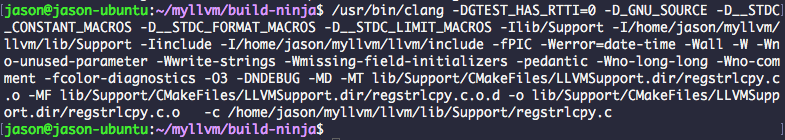

*用 clang 就没有问题了*

看来这里的 /usr/bin/cc 并非是我们前面安装的 clang 6.0 啊，最后在来做一次验证，看看这个 cc 到底是什么。

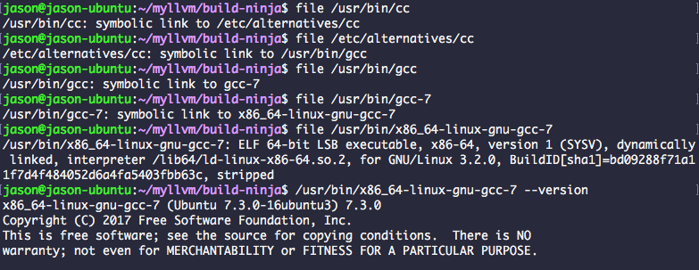

*追查 cc 到底是什么*

cc 是一个软链接，而且是多级软连接，最终指向了 x86_64-linux-gnu-gcc-7，并非 clang。而此前 cmake 在生成编译工程的时候，在日志里明确告诉我们它使用的是 clang 6.0，还信誓旦旦的进行了各种检测。猜测问题出在 cmake 生成的工程里没有指定 C 编译器，ninja 和 cmake 所认为的默认编译器不一样。

找到了问题，解决起来就简单了，我们只需要显示指定编译器路径即可。

```bash
$ cmake -G Ninja -DCMAKE_C_COMPILER=/usr/bin/clang -DCMAKE_CXX_COMPILER=/usr/bin/clang -DCMAKE_BUILD_TYPE=Release -DCMAKE_INSTALL_PREFIX="/home/jason/myllvm/install-ninja" -DFCOLOR_DIAGNOSTICS=OFF  ../llvm
$ ninja -j6
```

结果很不幸，再次遇到错误。

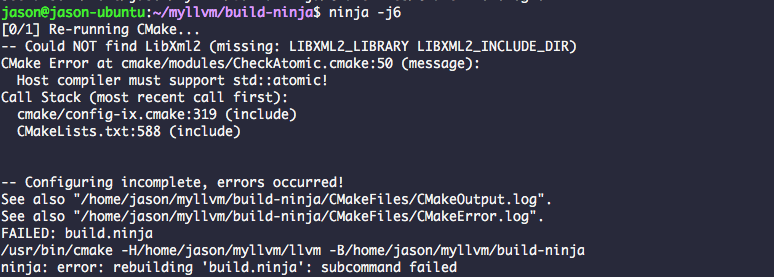

*ninja 编译再次遇到错误*

这次的问题又不同了，看起来是因为缺少 libxml2 库造成的，那就安装一个吧。

```bash
$ sudo apt install libxml2-dev
```

安装完成之后，再次执行编译，发现 libxml2 的错误确实解决了，不过又发现了新的错误。

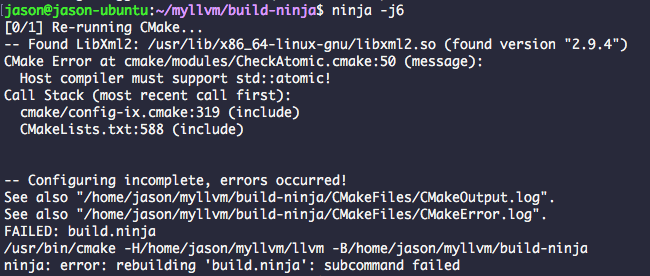

*ninja 又报了新的错误*

这次我们被告知宿主编译器缺少 std::atomic，也就是说我们的 clang 所用的 C++ 标准库缺少这个原子化模块。笔者猜测可能是由于我们安装的 clang 并不完美，LLVM 很复杂，每个人编译的结果都不一样，也许是由于缺少某些非核心库造成的。

那么我们考虑换一个编译器试试，既然系统里存在一个 gcc，那我们就用 gcc 来作为 C 和 C++ 编译器构建 LLVM 试试看吧。

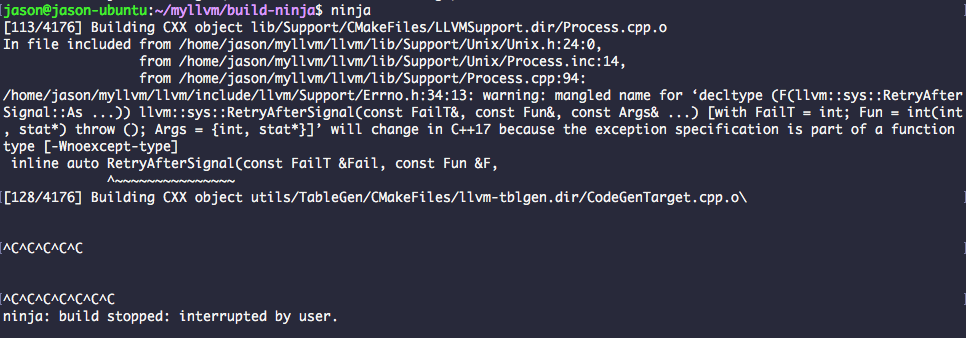

*编译到中途停住了*

开始看起来还挺顺利，结果到编译到第 128 个文件的时候停住了，整个虚拟机也出现假死，持续了一个多小时，我决定放弃使用 gcc。

想使用 clang 6.0 作为宿主编译器，依然绕不开 atomic 库的问题。我猜想是不是少安装了相关库造成的，我想到了 llvm 自带的 libc++ 与 libc++abi，于是把这两个库也装上了再试试。

```bash
$ sudo apt install libc++-dev
$ sudo apt install libc++abi-dev
```

装完再试，依然报同样的错。而后在官方讲交叉编译的文档中看到了另一种指定编译器路径的写法[注解]，我决定试一试。

在有些 shell 环境下，需要在开头加上 env，否则无法执行。

```bash
$ CC='clang' CXX='clang++' cmake -G Ninja -DCMAKE_BUILD_TYPE=Release -DCMAKE_INSTALL_PREFIX="/home/jason/myllvm/install-ninja" ../llvm
```

这次 atomic 的问题终于解决了，接下来终于可以正常编译了。不过让人意想不到的是，与 gcc 一样，编译过程再次被出现停顿。


*使用 clang 编译出现假死*

此时我开始反思，是不是我的虚拟机性能太差。处理器应该没有问题，刚分配了6个核给虚拟机，硬盘是很差的，笔者是用 USB 外接的 5400 转的机械硬盘。不过一般硬盘不至于会让进程卡死。内存也很差，笔者按照虚拟机默认选项，只分配了 1GB。如果是内存太少，确实可以解释假死问题，那么就多分配一点内存再试试吧。

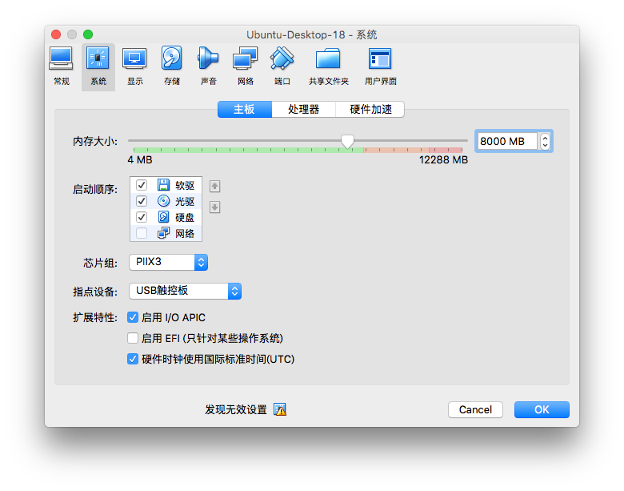
修改虚拟机内存分配

另外笔者考虑到并发数太多可能也会导致内存占用过多。这次把并发数降为 2（ninja的默认并发数为 8），继续编译。

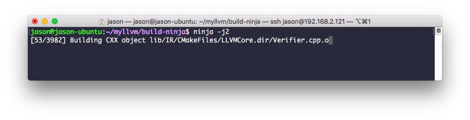

*增加内存，降低并发数，再次编译*

此时看起来编译过程就正常了，笔者通过另一个终端连接到虚拟机，再使用 top 命令查看当前系统运行是否正常。

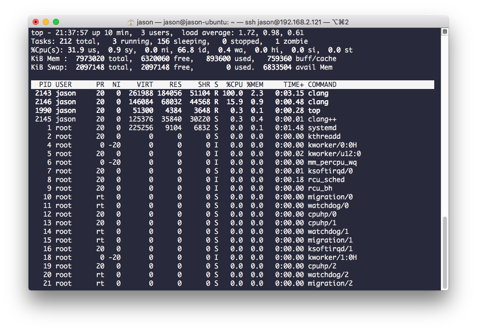

*用 top 命令查看系统运行状况*

可以看到，一个 clang 进程大约占用了 200MB 内存，之前只分配了 1GB，果然是不够用。操作系统在内存不足的情况下会频繁的换页[注解]，而硬盘又很慢，所以出现了卡死。

内存还有很大富余，CPU 也只使用了 30%（6盒用了2个），那么现在可以调整一下，把并发数提高一下应该没问题了。

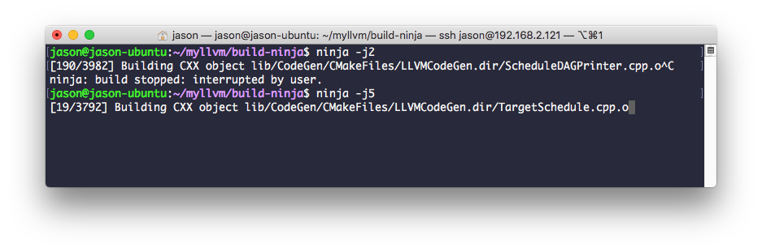

*提高并发数为 5*

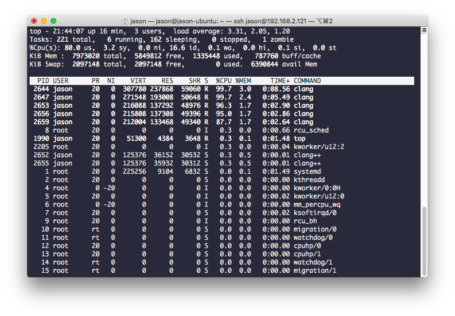

*并发数为 5 时系统运行状况*

此时内存依然有很大富余，CPU 已经占到了 80%，笔者有意不完全占用是为了留下一点用来响应其他操作。

现在你可以休息一下了，因为编译过程还很长。不过别急，笔者还想多啰嗦几句。

你是否觉得本书在带你游花园呢？说了这么多错误的方式有什么用，为什么不直接说出最正确的答案呢？

其实笔者并非有意误导你，此过程确为真实案例。而把这个案例从头讲到尾，每个错误步骤和尝试解决的过程都详加描述，是想告诉你两件事：

1. 文档有时候也不一定是对的，尤其是每个人的系统环境有很大区别；

1. 遇到问题很正常，Google 不到答案可能性更高，不要慌，多看多试多想；

下面你真的可以去休息一下了，出门散个步，再来杯咖啡吧。

。。。

漫长的等待之后，总算编译完成了。

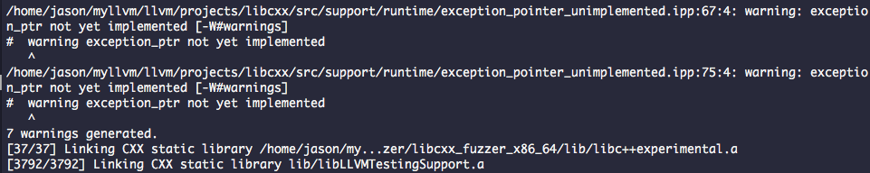

*编译完成*

接下来是安装。

```bash
$ ninja install
```

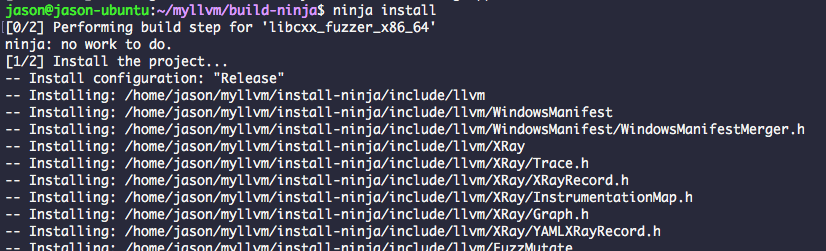

*安装 llvm*

接下来检查一下安装结果。

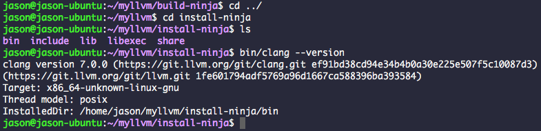

*检查安装结果*

## 其他系统上安装

### macOS

安装方法类似，只是使用的软件源有所不同而已。如果是从源码开始编译，方法是一样的。

### Windows

可以在 Cygwin 环境中获得与 Linux 中类似的工具链，具体的方法本书不会继续讲解。

到此，从源码编译安装结束。

## 使用 LLVM 编译程序

### 编译 C 程序

编写 C 程序 HelloLLVM.c

```cpp
#include <stdio.h>
int main() {
 printf("Hello LLVM!\n");
}
```

然后设置环境变量，让 shell 优先使用我们自己编译

```bash
$ export PATH=/my/install/path/bin:$PATH
```

验证一下是否设置正确

```bash
$ type clang
clang is /home/jason/myllvm/install/bin/clang
```

没有问题的话，执行编译命令
```bash
$ clang HelloLLVM.c -o HelloLLVM
```

如果没有出错，就可以执行编译结果了

```bash
$ ./HelloLLVM
Hello LLVM!
```

### 编译 C++ 程序

类似的，编写 C++ 程序 HelloLLVM.cpp

```cpp
#include <iostream>

using namespace std;

int main() {
 cout << "Hello LLVM!" << std::endl;
}
```

使用 clang++ 编译

```bash
$ clang++ HelloLLVM.cpp -o HelloLLVM
```

如果没有出错，就可以执行编译结果了

```bash
$ ./HelloLLVM
Hello LLVM!
```

### 编译 Objective-C 程序

Objective-C 程序编译所需的环境相对复杂，我们仅在 macOS 系统上进行如下编译测试。

编写 ObjC 程序 HelloLLVM.m

```objc
#import <Foundation/Foundation.h>

@interface HelloLLVM : NSObject

+ (void)sayHello;

@end

@implementation HelloLLVM

+ (void)sayHello
{
    printf("Hello LLVM!\n");
}

@end

int main() {
    [HelloLLVM sayHello];
    return 0;
}
```

你可能好奇，为什么不用 NSLog，因为 NSLog 在 macOS 系统提供的动态库中，我们安装的 LLVM 并不包含，日后再讲如何链接系统动态库。

```bash
$ cc -lobjc HelloLLVM.m -o HelloLLVM
$ ./HelloLLVM
Hello LLVM!
```

### 拆解编译过程

我们前面展示的编译过程是通过 Clang 进而调用 LLVM 编译出最终的程序，这其中包括了多个步骤。Clang 提供了众多编译参数，通过这些参数我们可以控制编译的过程，使其只进行其中的某一个或多个步骤。

```bash
$ clang --help | grep 'Only run'
  -c                 Only run preprocess, compile, and assemble steps
  -E                 Only run the preprocessor
  -S                 Only run preprocess and compilation steps
```

我们通过以上对帮助文档的过滤可以找到拆分步骤的参数。

#### 预处理

假设我们有一个自定义的头文件 print.h。

```bash
void print(const char *);
```

在 HelloLLVM.c 中 include 这个头文件。

```bash
#include "print.h"

int main() {
    print("Hello LLVM!\n");
}
```

执行下面的命令来看下预处理的结果.

```bash
$ clang -E HelloLLVM.c -o HelloLLVM.e
$ cat HelloLLVM.e
# 1 "HelloLLVM.c"
# 1 "<built-in>" 1
# 1 "<built-in>" 3
# 349 "<built-in>" 3
# 1 "<command line>" 1
# 1 "<built-in>" 2
# 1 "HelloLLVM.c" 2

# 1 "./print.h" 1

void print(const char *);
# 3 "HelloLLVM.c" 2

int main() {
    print("Hello LLVM!\n");
}
```

可以看到在开头是一些注释，紧接着就是 print.h 的内容，被原封不动的插入到了预处理结果中。

#### 生成汇编代码

我们基于前面生成的预处理的结果生成汇编代码。

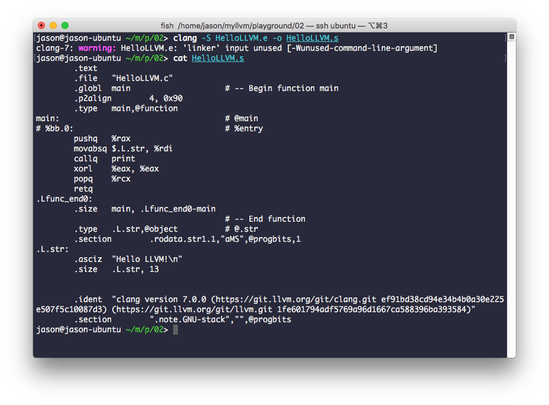

*生成汇编代码*

#### 汇编

这一步将把汇编代码翻译成机器码。

```bash
$ clang -c HelloLLVM.s -o HelloLLVM.o
$ file HelloLLVM.o
HelloLLVM.o: ELF 64-bit LSB relocatable, x86-64, version 1 (SYSV), not stripped
```

这一步生成的文件通常成为对象文件，更专业的说法可能是可重定位文件。之所以说可重定向是因为这个文件的符号在下一步过程中会被放在一个更大的文件中，那么符号的位置也自然会被重新确立位置。

#### 链接

这是我们刚才提到的 print.h 对应的 print.c 文件。

```bash
#include <stdio.h>

void print(const char * str)
{
    printf("%s", str);
}
```

我们先把前面的 print 函数也编译成对象文件。

```bash
$ clang -c print.c -o print.o
$ file print.o
print.o: ELF 64-bit LSB relocatable, x86-64, version 1 (SYSV), not stripped
```

链接过程实际上是使用 ld 命令，不过这个命令需要配合许多参数一起使用，我们很少会手动调用，一般是通过编译工具来帮助我们完成，这里我们使用 clang 来完成链接过程。

```bash
$ clang HelloLLVM.o print.o -o HelloLLVM
$ file HelloLLVM
HelloLLVM: ELF 64-bit LSB executable, x86-64, version 1 (SYSV), dynamically linked, interpreter /lib64/ld-linux-x86-64.so.2, for GNU/Linux 3.2.0, not stripped
```

我们可以通过给 clang 加 --verbose 参数获得更多编译细节，你可以看到 clang 确实是使用了 ld 来完成链接过程的。

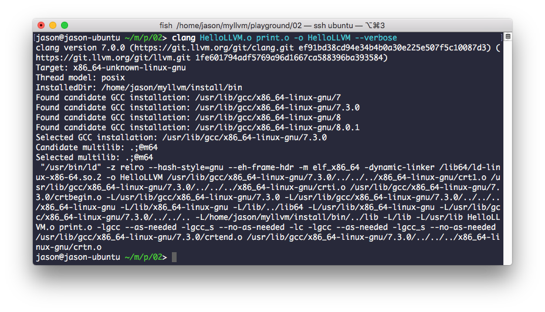

*获得编译器更多输出*

验证一下链接出来的可执行程序吧。

```bash
$ ./HelloLLVM 
Hello LLVM!
```

#### 中间表示

实际上作为一般的编译器都可以拆解成以上步骤：预处理、输出汇编、汇编、链接。而 LLVM 有强大的中间表示，这种中间表示可以以物理的形式存在，而非想 gcc 只能在内存中临时存在。

不过 clang 本身并没有开放这样的功能，clang 留了一个“后门”，通过它你可以直接控制 clang 背后的引擎程序（clang命令 实际上是一个调度程序，实际的工作都由它来完成）。

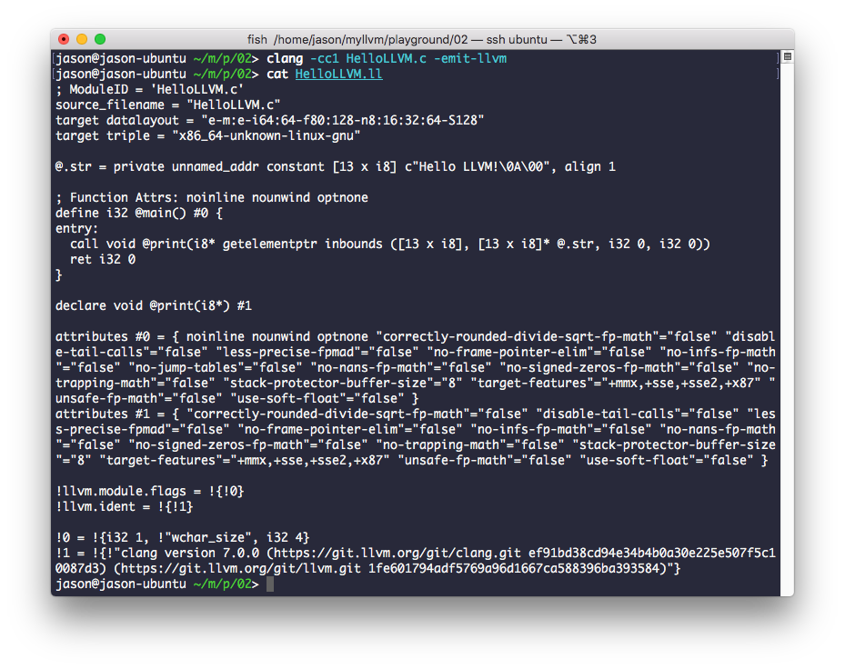

*LLVM 的中间表示*

打开这个“后门”就是通过加 -cc1 参数，参数 -emit-llvm 表示输出 LLVM 中间表示，默认会保存在同名的 .ll 文件中。

这里我们看到，.ll 文件是一个文本形式，我们还可以将其转换成二进制形式。

```bash
$ llvm-as HelloLLVM.ll
$ file HelloLLVM.bc
HelloLLVM.bc: LLVM IR bitcode
```

这个过程是可逆的，通过以下命令完成。

```bash
$ llvm-dis HelloLLVM.bc
```

中间表示也可以被编译。

```bash
$ clang -c HelloLLVM.ll -o HelloLLVM.o
```

或者

```bash
$ clang -c HelloLLVM.bc -o HelloLLVM.o
```

llc 是 llvm 的后端，可以用来把 中间表示编译成汇编。

```bash
$ llc HelloLLVM.bc -o HelloLLVM.s
```

这与前面用 clang -S 是一样的效果。

#### 中间表示链接

程序指令在优化的时候，单看独立的文件有时候不能很好的进行优化，所以 llvm-link 提供了把独立的 IR 文件链接在一起的功能。

我们先生成 print.c 对应的 IR 文件。

```bash
$ clang -cc1 -emit-llvm print.c

print.c:1:10: fatal error: 'stdio.h' file not found

#include <stdio.h>

         ^~~~~~~~~

1 error generated.
```

按照刚才的方式，结果报错了，原因是 我们加入了 -cc1 参数，使用了背后的引擎，没有调度工具 clang 帮助我们添加指定头文件目录的工作。但这也不难，我们通过 --verbose 看看 clang 都加了那些参数。

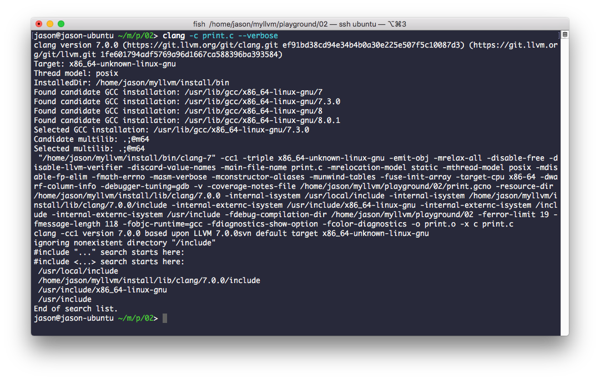

*获得编译器的更多输出*

把里面的参数复制出来，并修改 -emit-obj 为 -emit-llvm，去掉 -o print.o。

```bash
clang -cc1 -emit-llvm -triple x86_64-unknown-linux-gnu -mrelax-all -disable-free -disable-llvm-verifier -discard-value-names -main-file-name print.c -mrelocation-model static -mthread-model posix -mdisable-fp-elim -fmath-errno -masm-verbose -mconstructor-aliases -munwind-tables -fuse-init-array -target-cpu x86-64 -dwarf-column-info -debugger-tuning=gdb -v -resource-dir /home/jason/myllvm/install/lib/clang/7.0.0 -internal-isystem /usr/local/include -internal-isystem /home/jason/myllvm/install/lib/clang/7.0.0/include -internal-externc-isystem /usr/include/x86_64-linux-gnu -internal-externc-isystem /include -internal-externc-isystem /usr/include -fdebug-compilation-dir /home/jason/myllvm/playground/02 -ferror-limit 19 -fmessage-length 118 -fobjc-runtime=gcc -fdiagnostics-show-option -fcolor-diagnostics -x c print.c
```

注意不要死板的复制书中内容，因为路径可能不一样。

此时得到了 print.ll 文件，你可以查看以确认。

现在我们把两个 IR 文件链接起来。

```bash
$ llvm-link print.ll HelloLLVM.ll -S -o all.ll
```

查看 all.ll 你会发现同时出现了 print 和 main 两个定义。

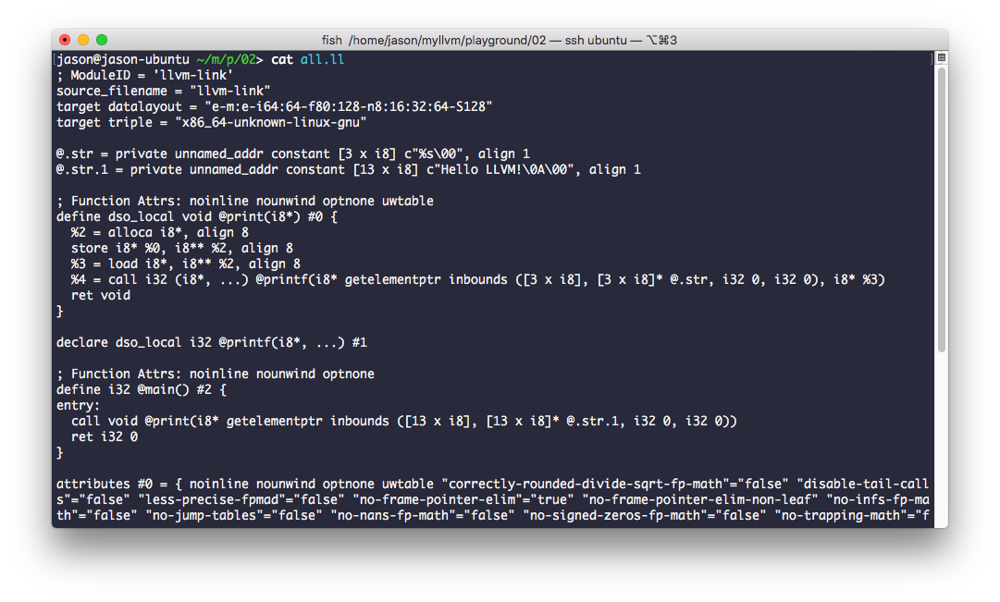

*查看all.ll*

#### 语法分析

clang 还有一个有意思的功能，输出程序的抽象语法树。

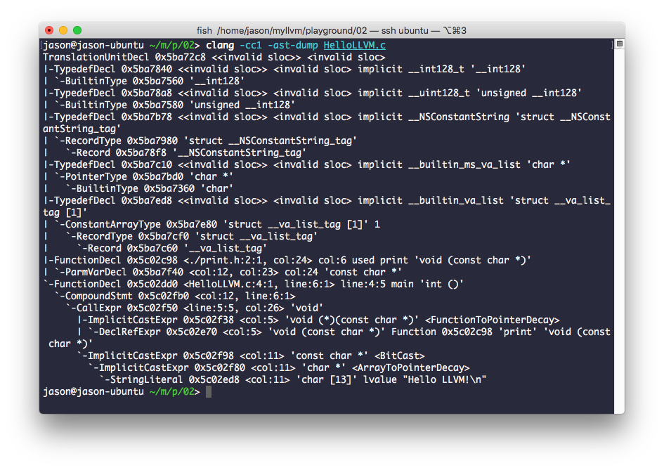

*输出语法树*

你甚至可以输出图形的格式，在此就不多做演示了。


本章完。
