# 第三章 交叉编译

上一章中，我们自行编译了 LLVM 并用其编译了几个小程序。不过这些小程序只能在与我们编译环境相同架构的设备上运行。现实情况是，编译的目标机器常常不是理想的开发环境。例如开发智能手机应用，我们通常采用 PC 机进行开发，两者所用的 CPU 架构并不相同。于是我们可能需要在 PC 机（X86架构）上编译出智能手机（通常是ARM架构）的程序，在这就是交叉编译所做的事情。

## 准备LLVM

交叉编译中最重要的环境是生成具有与编译机不通目标的指令，于是我们的编译器必然需要具有生成对应目标的后端用以生成目标指令。不仅如此，编译过程还需要完整的工具链，包括汇编器、链接器、库、头文件等。

GCC 会针对每一个编译主机和目标架构提供一套完整的套件，包含了二进制、头文件和库等。所以通常使用起来比较简单，下载对应的安装包，解压到一个合适的目录就可以使用了，其自带的编译器会使用自带的头文件和库。

然而 LLVM 有所不同，LLVM 是复用一套编译系统去负责多个目标的编译任务，通过 -target 选项来区分。这样的好处是开发者可以维护一套编译环境即可编译多个平台和架构的程序，操作系统发行商只需要发型一套软件包即可。

但是这样确实会给开发者带来了使用上的麻烦，因为要不同的目标架构和系统的程序会需要链接不同的库，而编译器需要足够的参数被告知去哪里寻找这些库和头文件的位置。不仅如此，这些编译所需的库通常也需要开发者自己去准备。

如果希望进行交叉编译，就需要我们的编译器支持目标架构，即拥有对应的后端。LLVM 支持哪些目标架构是在其编译的时候决定的，而前一章我们在编译 LLVM 的时候，并没有指定相关的参数，即 LLVM_TARGETS_TO_BUILD。不过该参数有个默认值 LLVM_ALL_TARGETS，即所有支持的架构，所以我们编译的 LLVM 实际上已经是支持很多架构的了。

如果想知道我们的 LLVM 支持哪些架构，可以通过 llc 命令查看。


可以看到支持的架构非常全，大多我们平时很少用到，笔者目前只用得到 arm/arm64/x86/x86_64 几个，那么我们来调整一下编译参数，看这个列表是否会有所变化。

```sh
$ env CC='clang' CXX='clang++' cmake -G Ninja -DCMAKE_BUILD_TYPE=Release -DCMAKE_INSTALL_PREFIX="/home/jason/myllvm/install-ninja" -DLLVM_TARGETS_TO_BUILD="ARM;AArch64;X86" ../llvm
$ ninja -j6
$ ninja install
```

重新编译完成之后，再查看支持的架构。

注：如果编译过程中有错误，可能需要把 build 目录删除再重建。

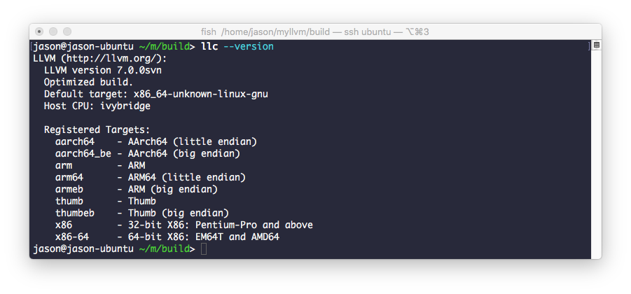

可以看出比之前的版本少了许多架构的支持，不过这里有必要说明一下这些架构的名称及其含义。我们这次编译的时候，LLVM_TARGETS_TO_BUILD 参数填的是 "ARM;AArch64;X86"，这三个中 ARM 是 32-bit 的 arm 架构，AARCH64 是 64-bit arm 架构，thumb 是一种 16-bit arm 架构，X86 包含了 32-bit 和 64-bit，而 arm 系列架构又分了大端和小端，于是有了这么多的组合，另外 AARCH64 与ARMV64是同一个架构，只是不同的叫法。笔者开始很好奇为什么编译参数中不是单个指定某些种具体的架构（例如：AArch64 little endian）而是一个子系列。后来看了 LLVM 后端源代码就豁然开朗了。


从目录结构可以看出，那么多目标架构，实际上总共就这几个实现，即 ARM 列的大端和小端，X86 系列的 32-bit 与 64-bit，实际上是同一套代码实现的。


从这里我们可以看出，thumb 架构实际上是合用了 ARM 32-bit 的实现，我们下面做个验证。

```sh
env CC='clang' CXX='clang++' cmake -G Ninja -DCMAKE_BUILD_TYPE=Release -DCMAKE_INSTALL_PREFIX="/home/jason/myllvm/install-arm" -DLLVM_TARGETS_TO_BUILD="ARM" ../llvm
```

我们不用安装，检查一下编译结果即可。

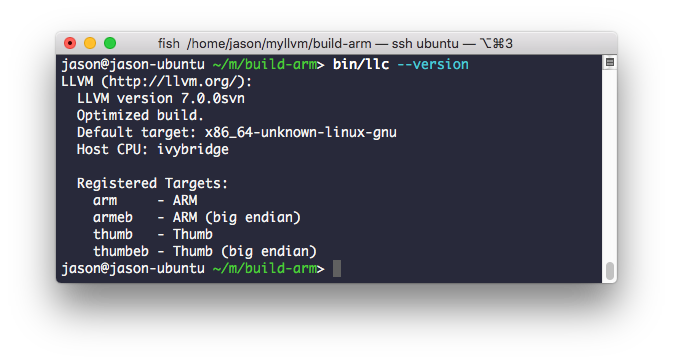

此时我们发现，如果参数 LLVM_TARGETS_TO_BUILD 仅设置 ARM，编译结果支持了 ARM 和 Thumb 的大端和小端，即 arm 32-bit 和 16-bit 系列共四种架构，验证了我们的推测。

既然我们的 LLVM 支持多个目标，接下来我们测试一下是否可以在 X86 环境下编译出 arm64 的程序。

## 用 docker 代替虚拟机

在继续本书的内容之前，我决定不再使用虚拟机来做演示。因为虚拟机的运行非常消耗性能，运行过程中也经常出现卡死等问题。目前因为 macOS 已经内置了虚拟化技术，新的 docker 在 macOS 上运行已经不再依赖 virtual box，因而效率非常高，体验接近物理机。下面我就来介绍一下如何用 docker 来搭建我们的编译环境。

首先下载并安装 docker for mac，下载地址 https://docs.docker.com/install/。打开之后会在任务栏上出现 docker 的图标，然后需要等待 docker 启动好。接下来你可能需要做一些设置来分配更多的资源，比如 CPU 数量，内存占用等。你可以点击 docker 图标，打开 Preferences 进行设置。调整设置后需要点击 Apply & Restart 按钮来应用你的设置。

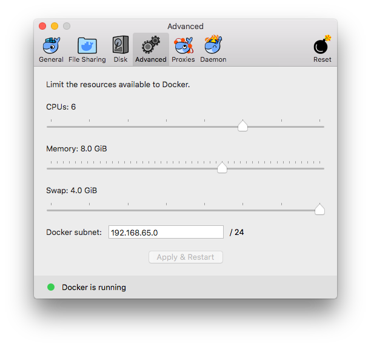

接下来测试一下 docker 命令。

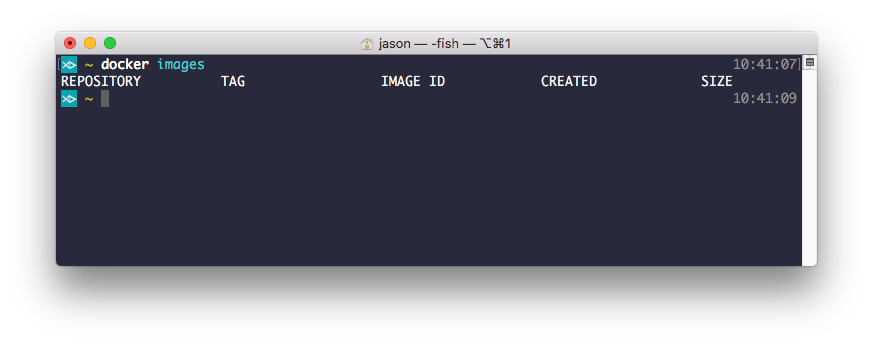

可以看到，此时 docker 命令已经可以使用。然而此时我们还没有镜像，无法使用虚拟环境。我们之前的编译环境基于 Ubuntu，Ubuntu 官方提供了各个版本的 docker 镜像供我们下载。我经过测试发现最新版的 Ubuntu 镜像 18.04 在编译 llvm 的时候会遇到障碍，而 16.04 可用，我们下面就以 16.04 来做演示。

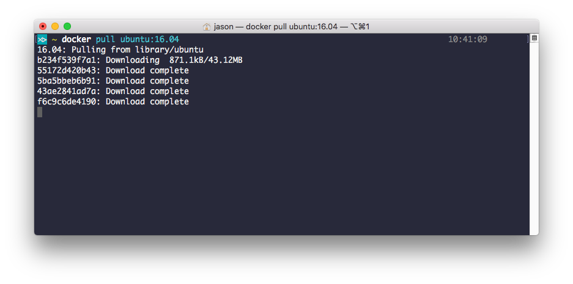

经过一段时间的等待。。。


此时我们已经下载好了 Ubutun 16.04 的镜像，下面来启动。

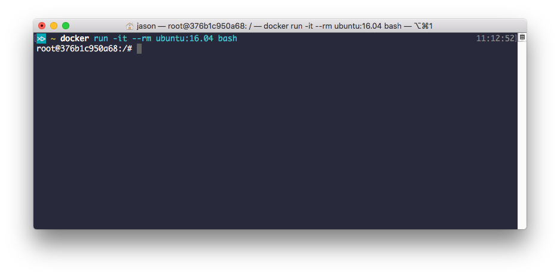

你会发现，相比虚拟机，docker 容器的启动实在是太快了。接下来我们需要把系统做必要的更新，正常使用 apt update 和 apt upgrade 即可。


接下来安装一些必要的软件。

```sh
$ apt install git vim cmake ninja-build clang libxml2-dev libc++-dev libc++abi-dev
```
下面我们把当前的容器做个保存，这样后续如果有需要可以退回来。

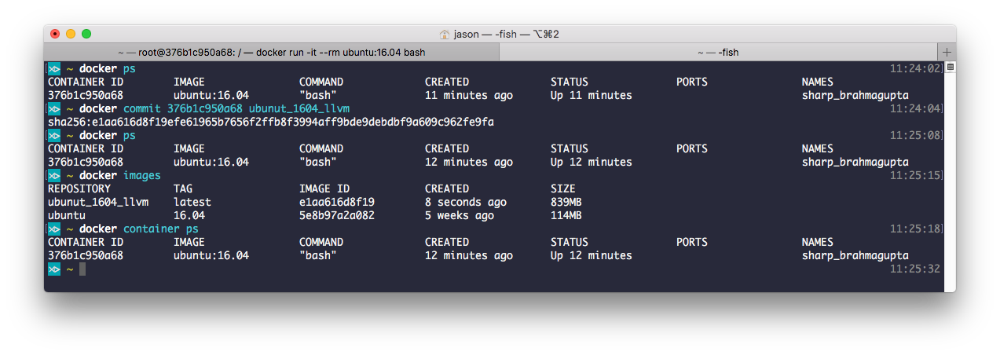

提交之后，我们可以看到多了一个镜像，是我们自己命名的 ubuntu_1604_llvm。

接下来就要获取 llvm 源代码了，不过 llvm 的代码非常多，因此你可能需要考虑一下，是复用以前下载的源码还是直接在容器中获取。不管你之前有没有可复用的源码，我都强烈建议你把 llvm 的源码放在外部，用 docker 把代码目录映射到容器中，即数据与系统分离。这样即不会造成容器过大，也不会因为容器回滚导致代码丢失。

下面就来演示如何做目录的映射。首先从当前的容器中退出，再重新启动。假设你已经在外部准备好了源码，那重新启动的时候可以这样来做目录的映射。


接下来进入映射来的目录，重新编译 llvm。

```sh
$ env CC='clang' CXX='clang++' cmake -G Ninja -DCMAKE_BUILD_TYPE=Release -DCMAKE_INSTALL_PREFIX="/myllvm/install-ninja" -DLLVM_TARGETS_TO_BUILD="ARM;AArch64;X86" ../llvm
$ ninja -j6
$ ninja install
$ export PATH=/myllvm/install-ninja/bin:$PATH
```

顺利完成之后进行我们后面的内容。

编译程序

下面我们编写一个简单的 C 程序，尝试将其编译成 arm64 架构的程序。

```C
#include <stdio.h>

int main()
{
    int a = 1;
    int b = 2;
    printf("%d + %d = %d\n", a, b, a + b);
    return 0;
}
```

使用 Clang 进行交叉编译需要用 -target 参数来指定编译目标，这里我们用 aarch64-linux-gnu，即所谓的三段式目标表示形式。

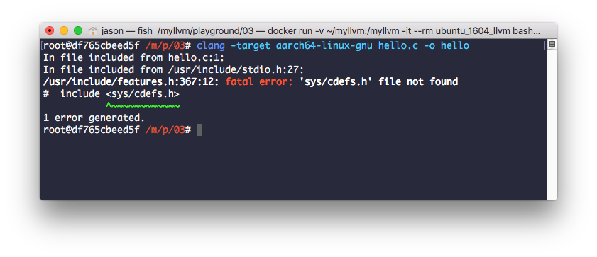

此时编译报错了，错误是因为编译器找不到某个头文件。我们前文已经提到过，交叉编译环境需要目标架构所需的相关库和头文件。这部分应该由操作系统或者硬件厂商提供，我们需要自行获取。那么我们需要获取哪些库呢？无非是C/C++标准库和链接器，我们试着通过 apt 的搜索命令来查询。

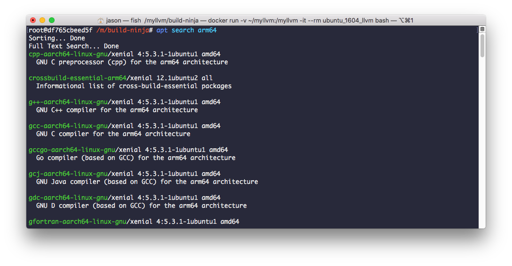

根据当前环境的 GCC 版本，我们来安装以下库。

```sh
$ apt install binutils-aarch64-linux-gnu \
cpp-5-aarch64-linux-gnu \
g++-5-aarch64-linux-gnu \
linux-libc-dev-arm64-cross \
libstdc++-5-dev-arm64-cross \
libstdc++6-5-dbg-arm64-cross \
libstdc++6-arm64-cross \
libgcc-5-dev-arm64-cross \
crossbuild-essential-arm64
```

安装完成之后，再试一次，你会发现错误依旧。这是因为 Clang 并不知道我们安装的库在什么位置，我们可以使用 --sysroot=/path 来告诉 Clang。


这样看起来有效果，因为错误不一样了。这次的问题不再是找不到头文件，而是链接器找不到某个 .o 文件。这个问题困惑了我很久，后来我发现 llvm 开发的链接器 lld 可以解决这个问题。

要使用 lld，首先需要把 lld 的源码加入到编译目录中。

```sh
$ cd /myllvm/llvm/tools
$ git clone https://github.com/llvm-mirror/lld
```

接下来重新编译 llvm，注意此时需要将编译目录清空，否则 ninja 不会把新加的代码纳入进来编译，重新编译之后再回来。这次我们需要用 lld 需要使用参数 -fuse-ld=lld 来指定。


用了 lld 似乎完全没有变化，问题还在。不过我们可以看到，这里说找不到的文件，crtbegin.o 在 /usr/aarch64-linux-gnu 中确实不存在。而相关的库该装的都已经装好了，到底这个文件有没有？在哪里呢？那我们来搜索看看。

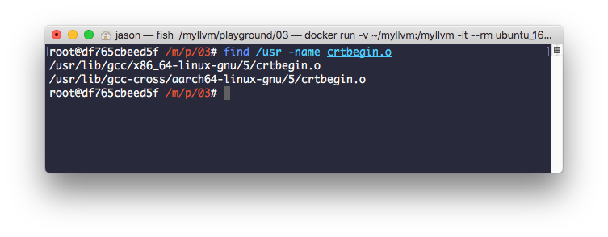

我们很幸运的找到了这个文件，有两个目录存在，第一个是 x86 的，另一个才是我们需要的。这个目录并不在 /usr/aarch64-linux-gnu 里面，或许需要我们手动指定来告诉 lld。

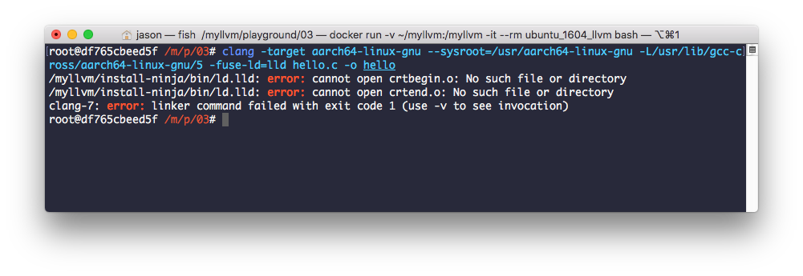

这次问题变少了，虽然 crtbegin.o 文件依然找不到，但后面的一些报错是没有了。为了搞清楚问题，我们给编译命令加上更多的输出来看看。我们可以通过添加 -v 参数来获得更详细的输出。


我们看最后，从这个参数可以看出，似乎是要求把当前目录的 crtbegin.o 和 crtend.o 拿来静态链接，而非像一般的系统库一样动态链接。也就是说这两个文件在一般系统上是不会提供动态链接库的版本，或许是因为功能的特殊性（在进程启动之初，动态链接库加载之前使用），要求它们只能静态链接到可执行文件中。

进一步，我们在 llvm 的源码中搜索，看看是否带了这两个文件。

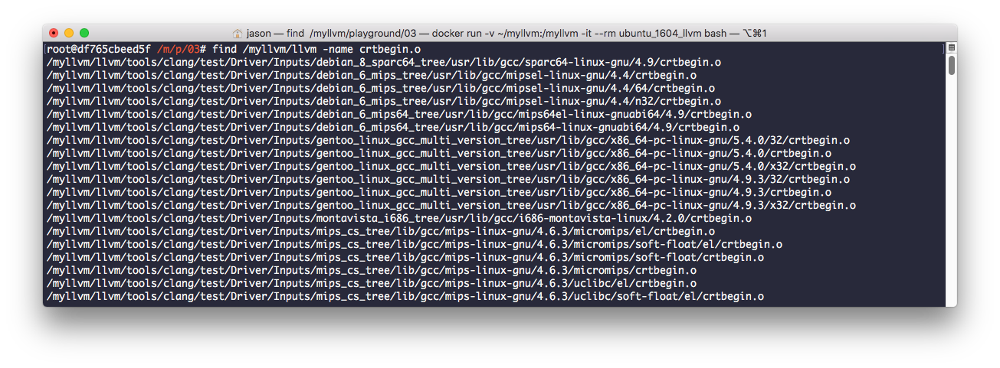

果不其然，在源码中不仅找到了，而且找到了非常多的版本，我们挑选一个目录来看。

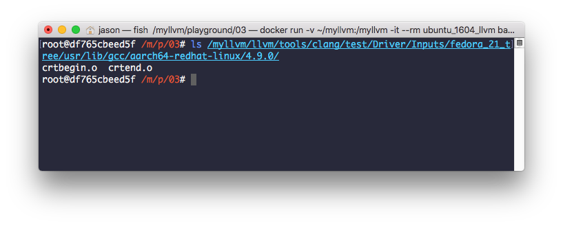

你会发现，这个目录中只有这两个文件，那就足见这两个文件的特殊性了。既然如此，我们的解决方法也非常简单，把这两个文件拷贝到当前目录，再编译试试。


一试果然可行，后面我们通过 file 和 readelf 来查看生成的可执行文件的信息，看起来没有什么问题。接下来就需要来实际检验可执行文件在 arm64 的物理机上的运行效果了。

## 运行程序

这一步就无法使用虚拟机来完成了，我们需要找一台真正的 Linux on arm64 的物理电脑来测试。目前市场上比较廉价的方案是大名鼎鼎的树莓派（Raspberry Pi）第三代。


注：国内购买的话，建议通过官方推荐的淘宝渠道购买，价格质量都有保障。

此时你可以按照官方指引烧录系统，不过很快你会发现，这个系统是 32 位的。现在我们有两个选择，要么重新编译我们的程序，编译目标设为 arm-linux-gnu 要么给设备安装一个 64 位的系统。目前有一些非官方的维护者维护了这样的系统，比如 https://github.com/sakaki-/gentoo-on-rpi3-64bit 。我个人建议安装64位操作系统，原则上这样更能发挥64位CPU的性能。

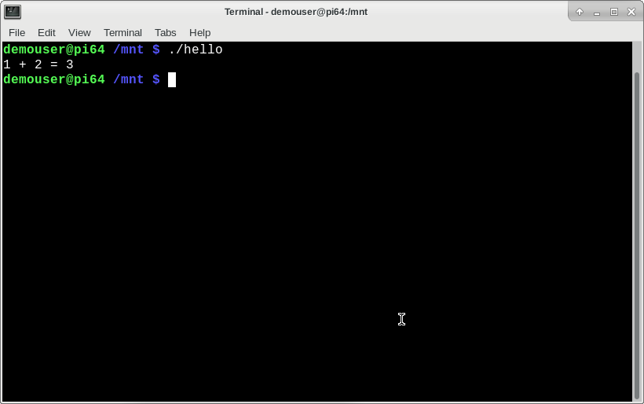

到此我们我们的一个简单的交叉编译过程就算完成了，如果要开发真是的应用程序，可能还需要在此基础上多做努力。

一般来说，一个完善的平台，例如 iOS 系统，会提供一整套的开发工具链，例如 Xcode 及其附带的 LLVM 等工具，通常开发者是不必为此过分操心。但是对于一些比较初级的平台，甚至是自己开发的硬件设备，那么这种交叉编译的环境的搭建就需要我们自己介入了。

本章完。


