# 第四章 搭建集成开发环境

前面几章我们一直在 LLVM 的外围打转，还不曾打开源码看一看究竟。不过面对 LLVM 庞大的工程，代码文件也非常多，也没有 IDE 的支持，完全不知道从何下手。不必担心，本章将带你进入 LLVM 的开发模式。

## 构建 Xcode 工程

如果你看过 LLVM 的源代码文件目录，你会发现只有代码，没有我们平时做应用开发时常用的各种 IDE 的工程文件。或许黑客们的世界只需要一个 emacs 就足够了，但是我还是更多的寄希望于一个顺手的 IDE 来辅助开发。

前面几章中，如果你还有印象，我们在编译 LLVM 源码的时候，关键步骤都是两个：用 CMake 构建 Ninja 工程；用 Ninja 构建 LLVM。这里的 CMake 类似编译一般 C 库用的 configure，而 Ninja 类似于  make。也就是说 CMake 是帮你做环境检查、工程配置、工程文件生成的工具，而 Ninja 是帮你调度编译器、链接器进行程序编译的工具。

CMake 不仅支持生成 Ninja 工程，还支持生成 Makefile、Eclipse 等。至于支持哪些目标构建工具，需要通过 cmake 命令来查看。我们运行之前配置好的 docker 容器，执行 "cmake --help"。

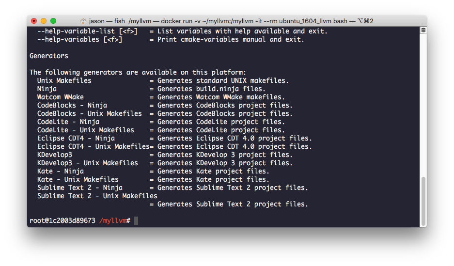

我们可以看到所有当前被支持的目标构建工具，包括命令行的，也有图形界面的。当然，这是在 Linux 环境下，不同的 OS 所支持的目标构建工具也会有所差别。笔者是多年的 macOS 用户，最熟悉的 IDE 是 Xcode，因此下面的内容我们将转移到 macOS 和 Xcode 上进行，如果你习惯于其他的 IDE 也不必担心，自行修改命令参数即可。

进入 macOS 的终端，再通过 cmake --help 你会看到支持的目标构建工具多了一个 Xcode。

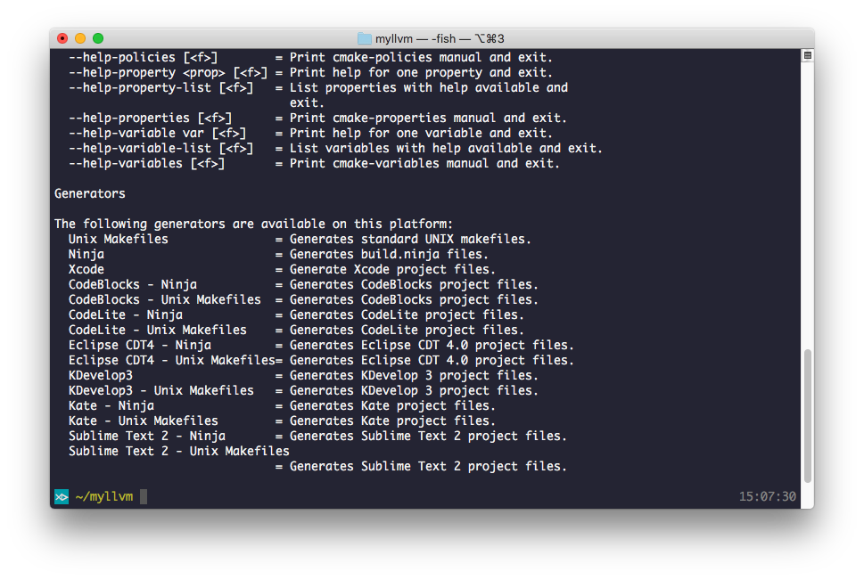

接下来我们以 Xcode 为目标，执行 cmake。（如果是其他目标，可能带有空格，需要前后加引号。）

```bash
$ cd ~/myllvm
$ mkdir build-xcode
$ cd build-xcode
$ cmake -DCMAKE_BUILD_TYPE=Release -G Xcode -DCMAKE_INSTALL_PREFIX=../install-xcode ../llvm
```

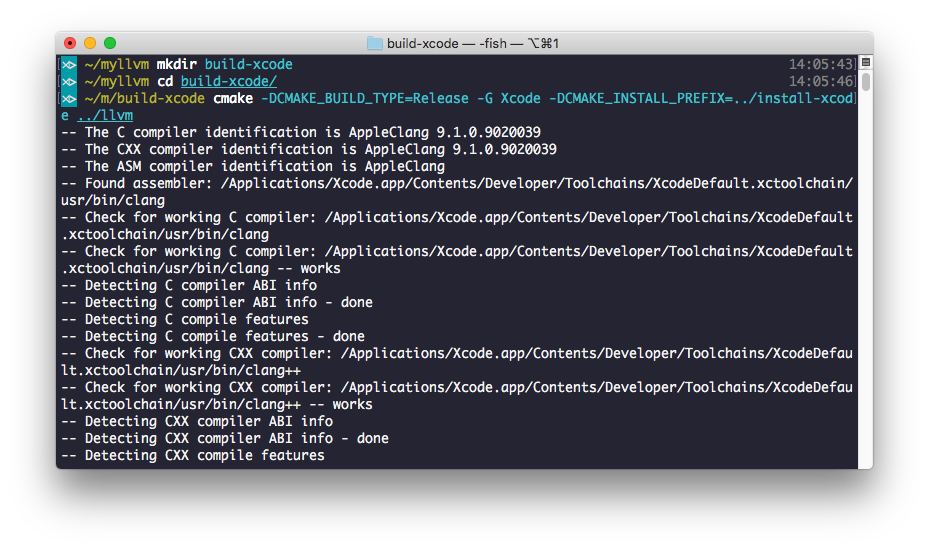

完成之后，我们用 Finder 打开 build-xcode 文件目录，此时可以看到一个 LLVM.xcodeproj 文件，双击之后 Xcode 启动。

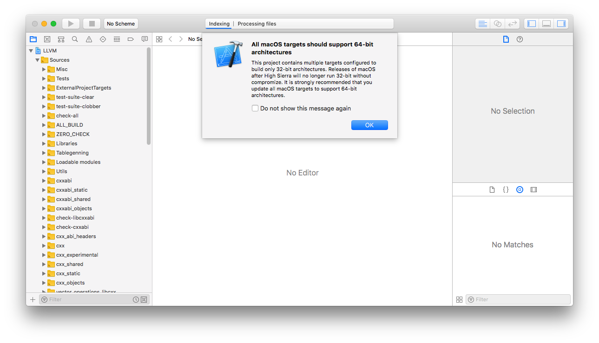

如果是在较高版本的 macOS 上，此时会 Xcode 可能会提示不支持 32 位架构，要求升级为 64 位，点击 OK 即可。

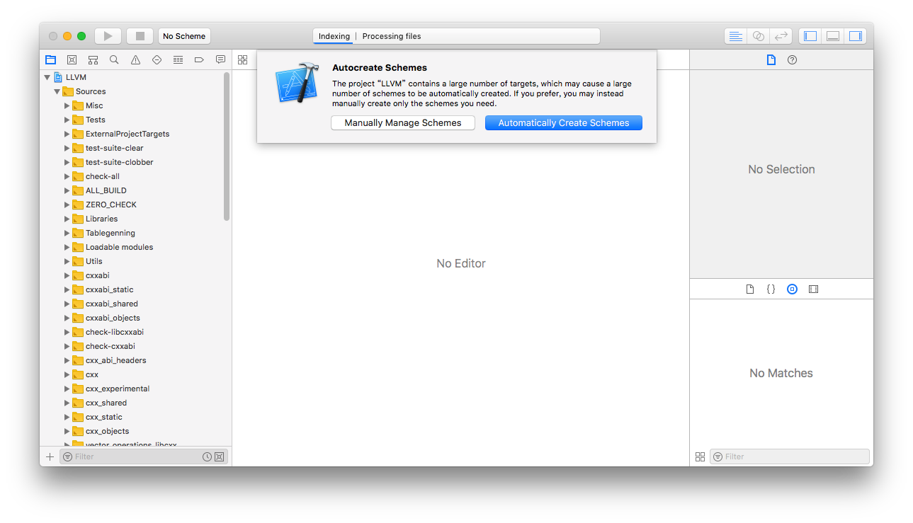

CMake 没有帮我们创建 Xcode shemes，此时 Xcode 会询问是否自动创建 schemes，点击默认选项即可。

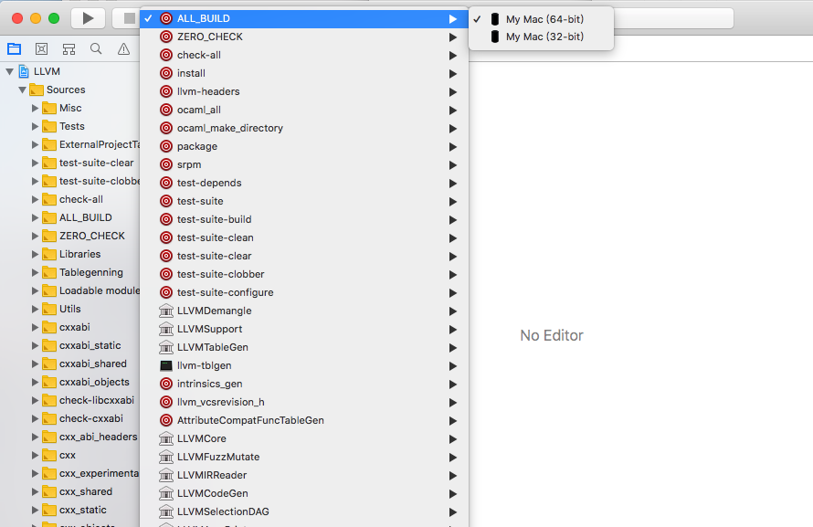

点击构建目标选项，你会发现工程中有非常多的 schemes，其中每个 scheme 对应一个 target ，target 生成可执行文件或者静态库 .a 文件，而它们共享整个工程里的代码，每个 target 可能只需要编译其中一部分文件，而这些 target 可能会对其他 target 有所依赖。例如我们选中左侧目录树的根结点，再在中间部分的左侧搜索一个 target 名为 llvm-lto，选中后在右侧 Build Phases 中可以看到。

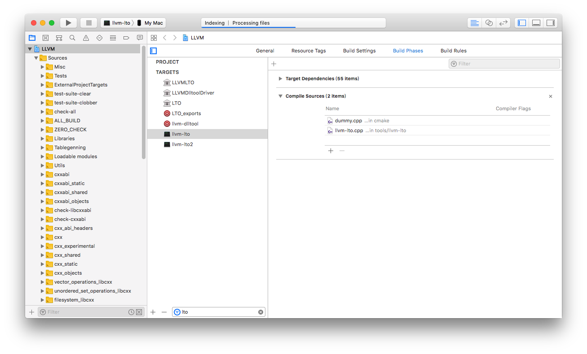

llvm-lto 这个 target 需要编译的文件只有一个 llvm-lto.cpp，而它依赖了其他 55 个 targets。下面我们来编译这个 target 试试看。在工具栏左侧的 target 选项中选择 llvm-lto，再点击左侧的三角形按钮。

进过漫长的编译过程，你可以在 Finder 中找到编译结果。

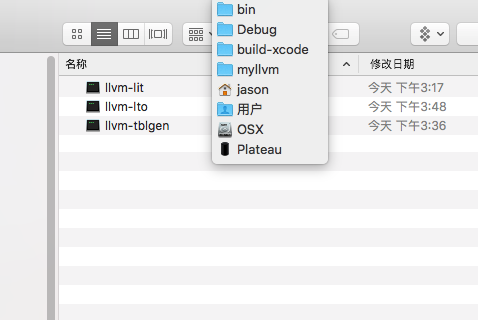

## 解决编译错误

接下来我们整体构建一次，选择 ALL_BUILD 这个 scheme，再点击运行按钮。

不过此时你可能会遭遇编译错误。

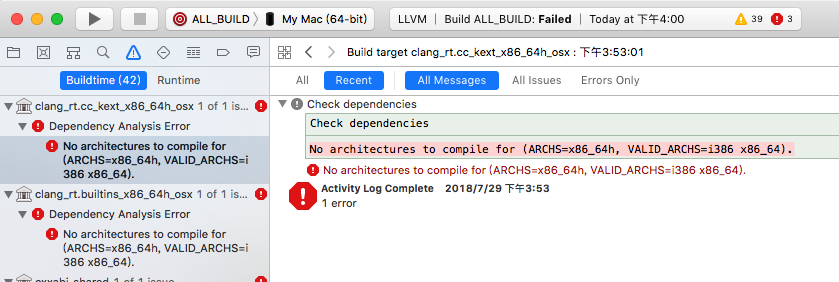

这里我们看到错误是说不支持架构 x86_64h，这是 Intel Haswell 系列芯片的架构，而笔者所用机器非此系列，自然是无法编译的。但是 CMake 错误的把这个架构加入到了目标中去，笔者尝过很多方法试图去掉，但是没有成功。后来看到非官方的说法，compiler-rt、libcxx、libcxxabi 这几个库不支持在 Xcode 中开发，好在这几个库暂时用不到，即便用得到也不非得在 Xcode 中开发，所以笔者被迫先把这几个目录从代码目录中移除，再次生成 Xcode 工程，即可编译了。

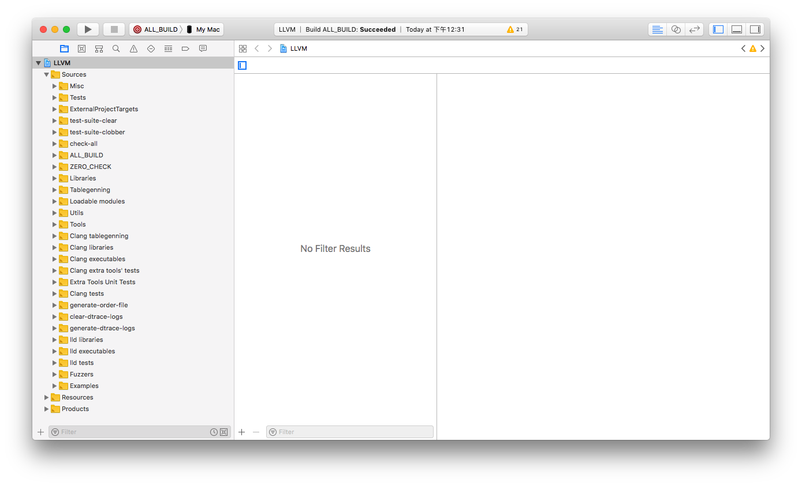

此时查看编译目录，检查编译结果。


ALL_BUILD 这个 scheme 只会编译，并不会安装，如果需要安装可以运行 install 这个 scheme。

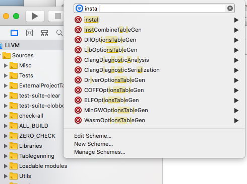

通过搜索可以方便的找到目标 scheme，选择后再运行，即可。

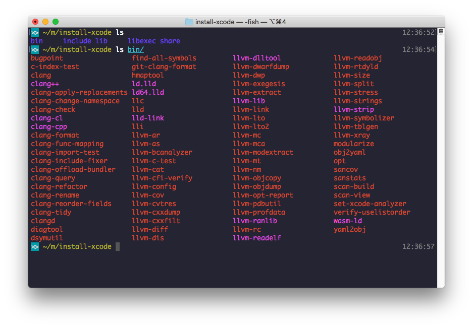

## 调试

在 Xcode 中调试非常方便。首先我们需要选择待调试的 target 对应的 scheme，我们这里选择 clang。然后按 CMD+< （需要按住 Shift）进入 scheme 编辑界面，然后给程序添加运行参数。

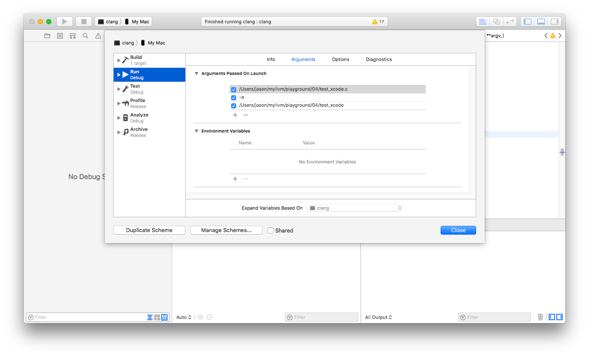

再找到程序入口函数，设置好断点。

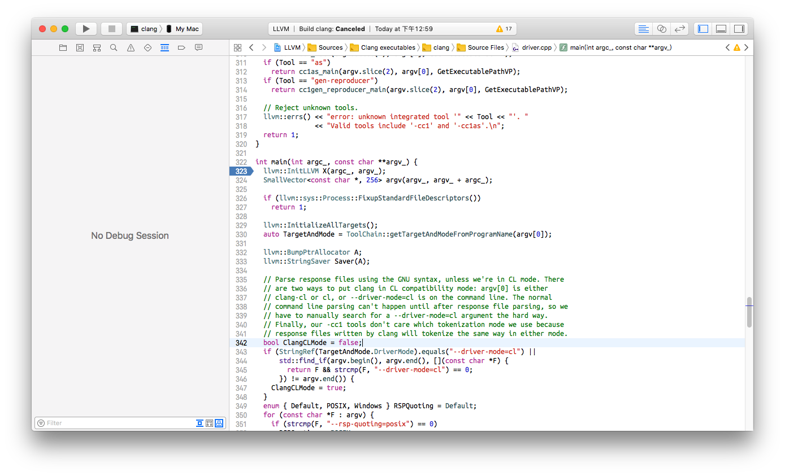

点击运行，稍后即可进入断点，我们还可以在调试窗口中执行 lldb 的调试命令。

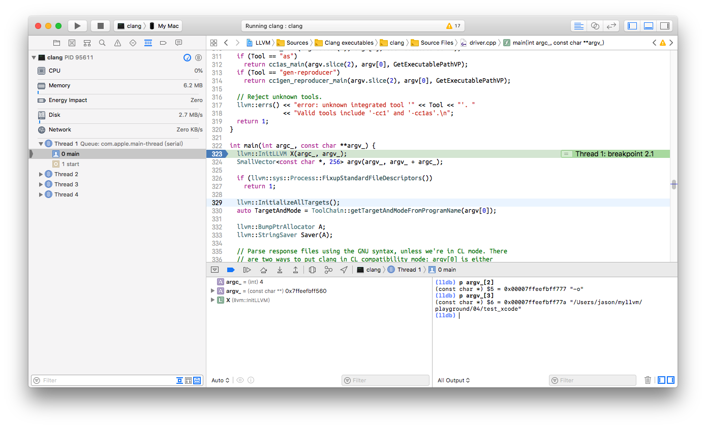

不过此次程序可能最终运行失败。

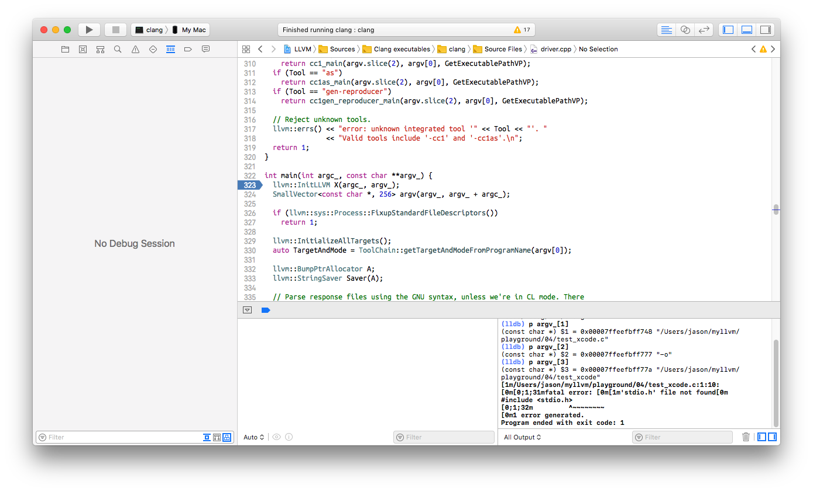

报错找不到 stdio.h 头文件。

这是因为我们的开发机没有安装好 Tool Chain，这是 Apple 提供的开发工具链，其中包括了标准库和头文件。安装的方法非常简单，执行 `xcode-select --install` 即可。

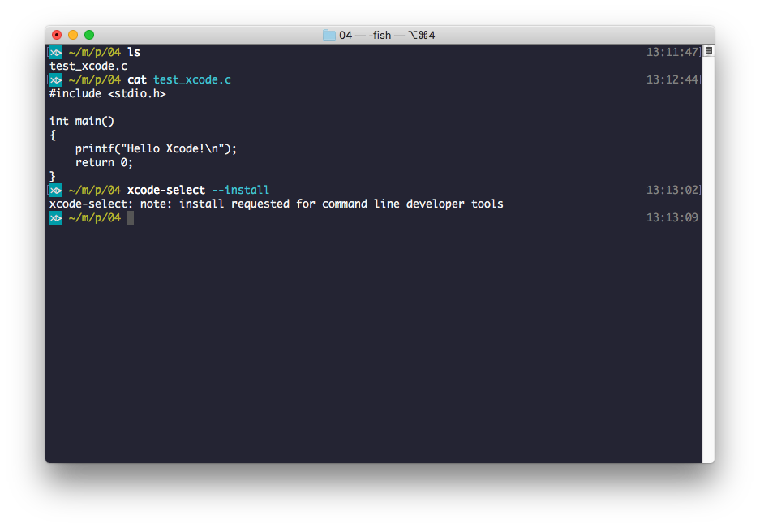

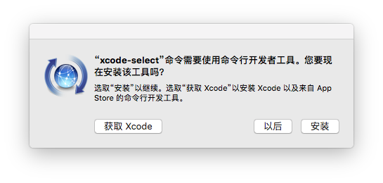

安装完成之后再次运行应该就可以成功了。

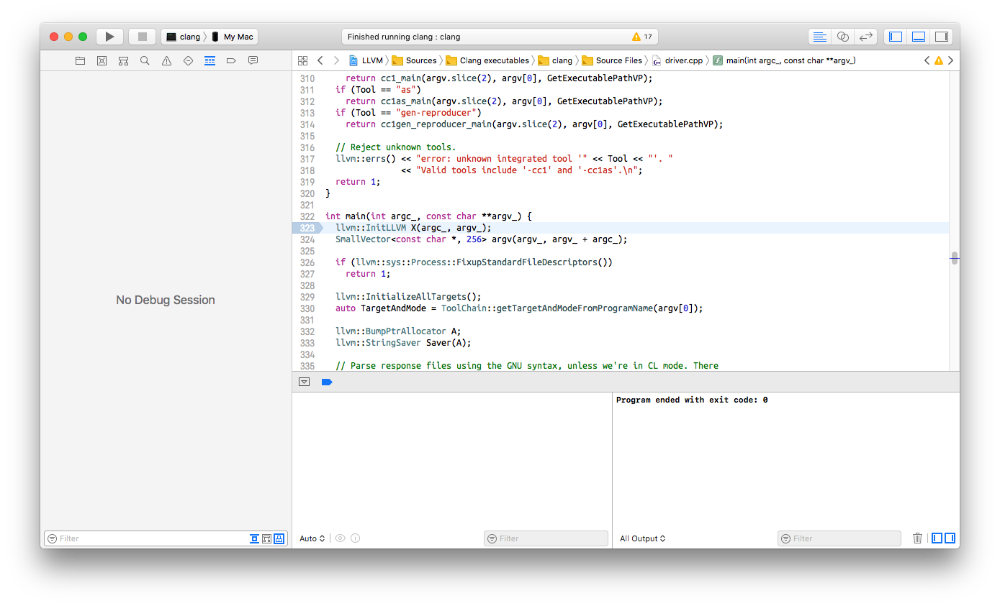

检查编译结果。

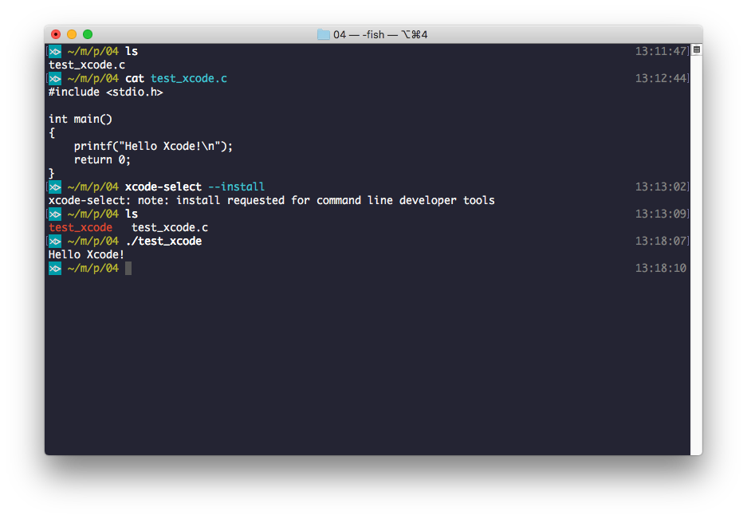


本章完。

