# 第五章 理解静态分析器

静态分析器是一种针对源代码的分析工具，目的是分析出代码中可能存在的风险，以提醒程序员。有时候程序员会用它来自查，更多的时候是部署在版本控制环节，在代码提交或者合并之前做一次自动检查。它与编译器编译时告警的不同之处在于，编译告警的问题一般相对简单直接，例如程序使用了已标记废弃的函数。而静态分析器往往能进行更加深度的分析，例如内存泄漏、未关闭流等。不过另一方面，既然分析逻辑更复杂，它的运行速度自然相对较低，因此一般不会频繁运行，而只设计在关键环节。

## Clang Static Analyzer

Clang 在静态分析这个方面显得非常出色，因为 Clang 从一开始就把“提供极有价值的错误和警告信息”作为设计目标之一。Clang Static Analyzer 不仅提供了独立的命令行工具，还被很好的集成到了 Xcode 当中，我们可以在 Xcode 中非常方便的使用它，使用快捷键 Command+Shift+B 即可。
我们来看一个例子：我们声明一个函数返回值为非空字符串，但是在代码逻辑中有一个分支将其设为了空，先来看看编译器是否会报警告。

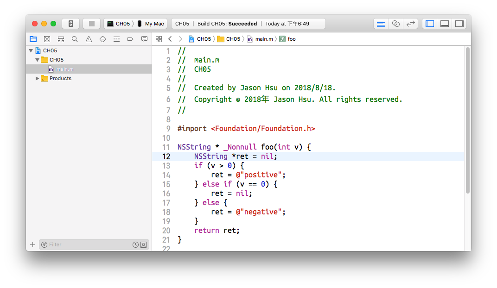

可以看到，编译成功，没有任何问题，再来看看静态分析的结果。

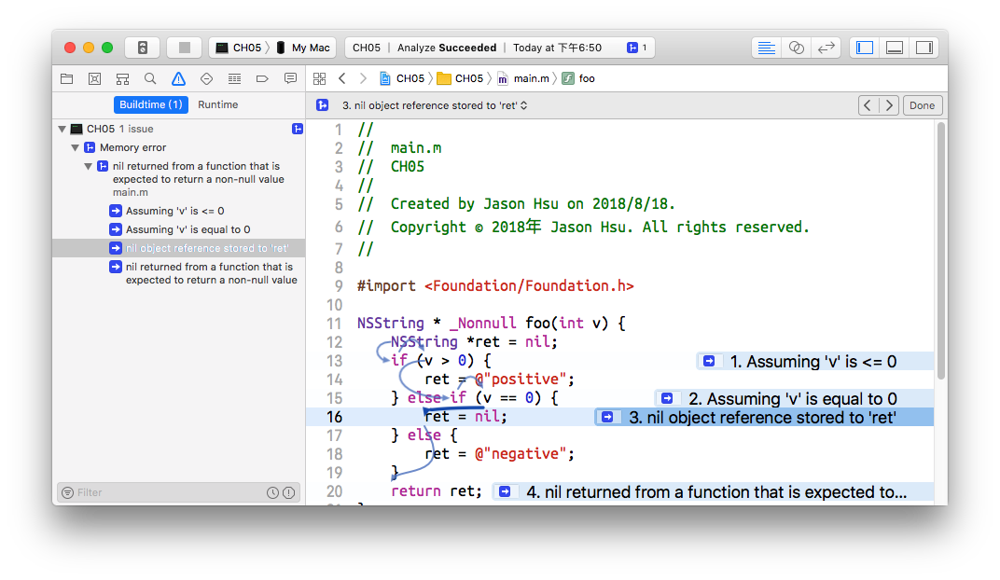

可以看到，静态分析器不仅给出了警告，还极为详细，甚至把分支条件清楚的告诉我们，就好像它真的做了一次覆盖完整的单元测试一样。

## 静态分析的原理

Clang 是如何做到如此精准的分析的呢？如果是我们自己人工去分析逻辑的话，我们会怎么分析呢？我想关键点在于关注变量 ret 的状态，然后构造分支逻辑成立的条件，最后判定每个分支逻辑的结果是否满足预期。

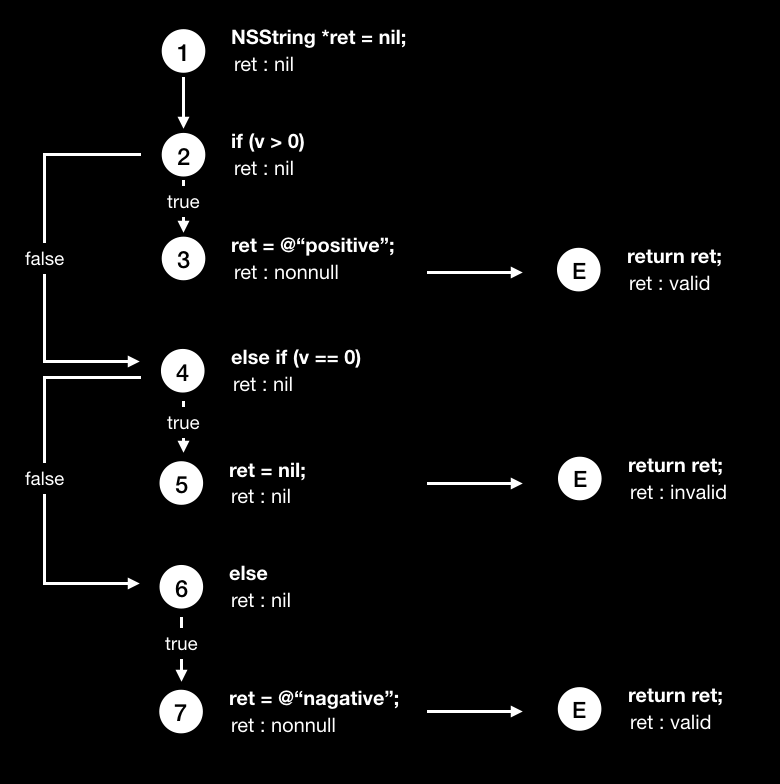

Clang 的静态分析基于一个称为“符号执行引擎”的程序，和我们人工分析的过程类似，符号执行引擎会分析程序逻辑的各个分支满足的条件，然后提前把这些条件准备好，如果有多个独立条件并存就会用排列组合的方式设计条件列表，再将这些不同预设的条件放到引擎中模拟执行，观察并记录符号的状态变化，具体某一项分析检查器只需要在合适的时机去读取符号的当前状态，判定是否有误即可知道代码是否存在问题了。

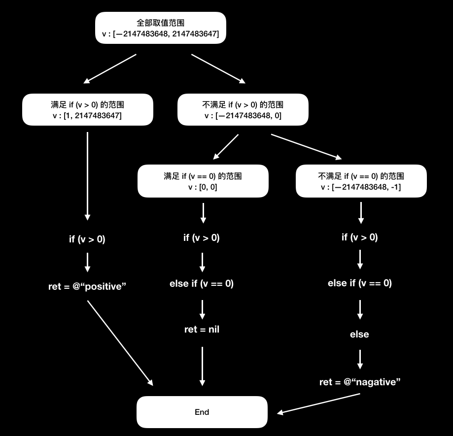

符号引擎不同于我们平时 debug，只会走一条路径，符号引擎会构建一棵树，把所有可能的路径都走一遍，但又不是真正的执行，它模拟的执行仅限于明确的行为，例如变量赋值、四则运算等，如果是调用其他程序模拟就可能会影响分析的结果。我们下面来修改一下前面的程序再分析一遍试试看。

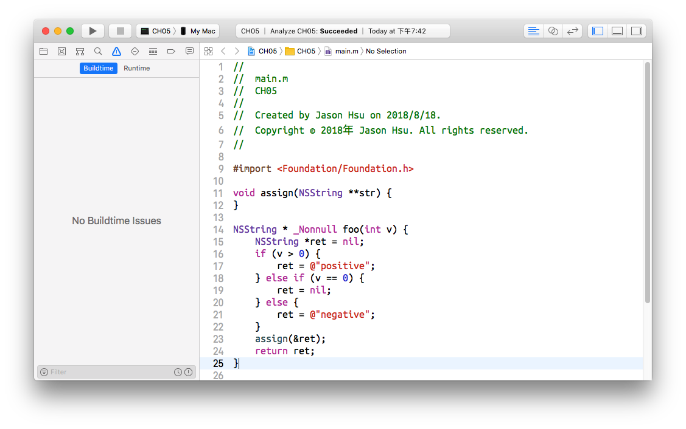

我们在程序的最后调用了一个函数，并且将变量 ret 的地址作为参数传入这个函数，虽然这个函数 assign 实际上没有做任何事，根本不会引起 ret 的值，但分析器似乎“很傻”，再也分析不出问题了。其实这是因为对外部程序的调用可能会影响 ret 的值，但符号执行引擎并不会真的去深度分析那个外部程序的过程，而是直接认为执行只会 ret 的状态变为“未知”，于是无法判定最终是否为空了。
Clang 之所以不做更深的分析，我想大概有两个原因，一是外部程序有太多不确定性，很多外部程序并不是当前文件定义的，那就更加不可能知道其内容了。二是会进一步加重分析的效率，静态分析本身已经很消耗计算资源了，再深度分析会大大影响效率，所以需要在效率和效果之间做权衡。

## 如何使用静态分析器

### 查看可用分析器列表

```
$ clang -cc1 -analyzer-checker-help
```

通过这条命令可以查看当前 clang 全部可用的分析器。

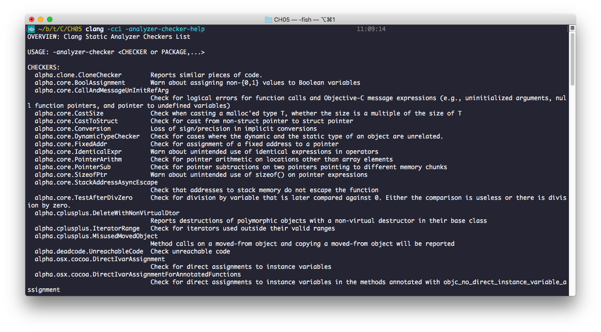

可以看到，分析器的命名是有命名空间的，其中 alpha 开头的是正在开发的实验性功能，core 开头的是基础的，等等。

### 使用指定的分析器分析代码

```
$ clang -cc1 -analyzer-checker=core main.m
```

使用这条命令可以指定使用哪些分析器，你可以指定一个具体的名称，也可以指定一个命名空间用以表示这个命名空间下所有的分析器，还可以指定多个名称，中间使用“,”分割。

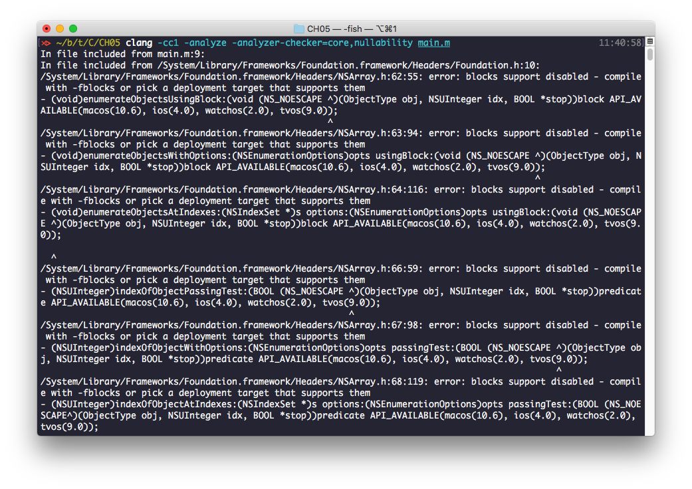

我们试着运行，结果 clang 报了大量的编译错误。这是因为 clang 不知道去哪里找 <Foundation/Foundation.h>。这个问题牵扯其他内容，我们此处暂不解决，先绕过去，把代码简化一下，去掉对 Foundation 的依赖。

```
//
//  main.m
//  CH05
//
//  Created by Jason Hsu on 2018/8/18.
//  Copyright © 2018年 Jason Hsu. All rights reserved.
//

#import <stdio.h>

void assign(char **str) {

}

char * _Nonnull foo(int v) {
    char *ret = NULL;
    if (v > 0) {
        ret = "positive";
    } else if (v == 0) {
        ret = NULL;
    } else {
        ret = "negative";
    }
    assign(&ret);
    return ret;
}

int main(int argc, const char * argv[]) {
    @autoreleasepool {
        // insert code here...
        printf("Hello, World!");
    }
    return 0;
}
```

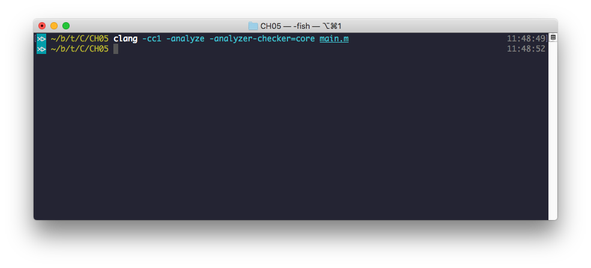

再次运行就没有问题了，当然也没有分析出问题，这是因为 core 命名空间下没有能够分析空值问题的分析器。那么我们调整一下分析器再试试。

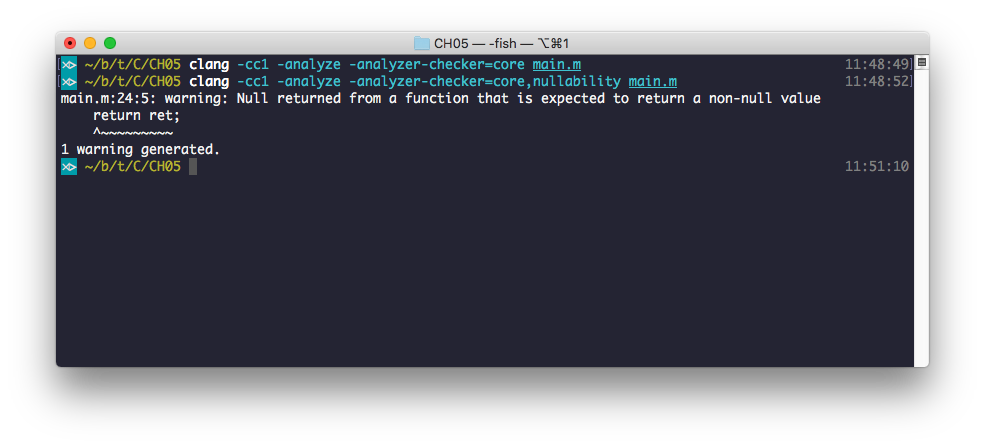

我们加入了 nullability 这个空间就可以找出我们前面在 Xcode 中所见的问题了。

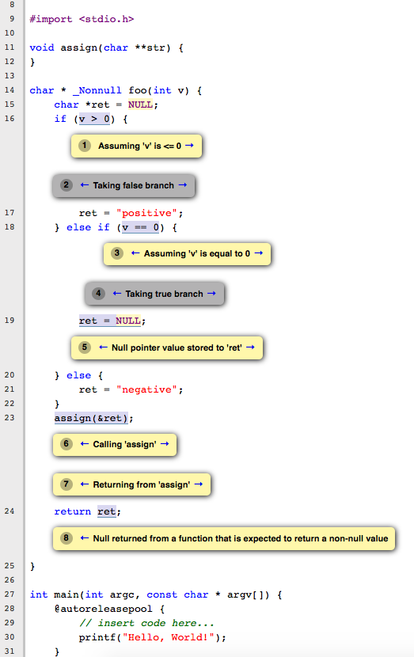

### 生成报告

在命令行下输出的日志略显单薄，可以提示出问题，但无法像在 Xcode 里一样输出详细的出错路径，但 clang 给我们提供了另一个选择，不需要 IDE 也可以看到详细的错误提示。

```
$ clang -cc1 -analyzer-checker=core main.m -o report
```

我们增加输出选项，执行后就可以生成一个对应名称的文件夹，里面会有 html 文件，打开之后就可以看到详细的错误描述了。

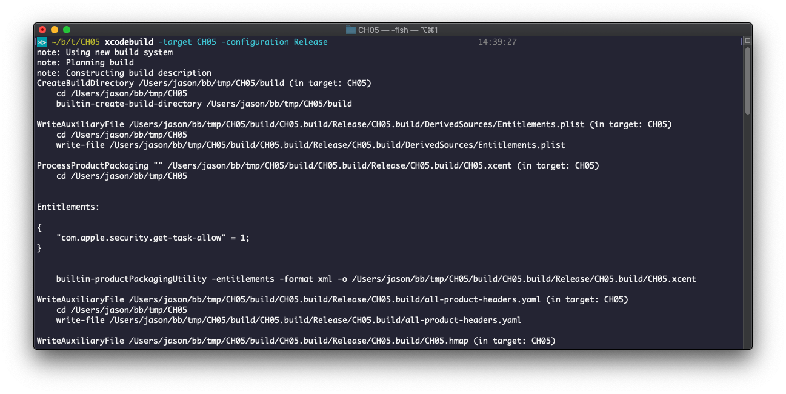

### 应对大型工程

前面我们讲述了如何使用 clang 针对单个文件进行分析，但实际的场景中，我们一般并不会单个的去编译一个个文件，而是利用针对工程的集成构建工具，例如 CMake 或者 IDE 来完成。这种情况，Clang 也给出了非常好的解决方案。
例如我们刚才的工程，使用了系统提供的 Foundation 库，而我们编译的时候并不关心这个库在什么位置，而是利用 Xcode 整体编译，Xcode 会帮我们把工程设置好，库的位置自然不需要我们操心。如果我们想用命令行去分析整个工程，而又想使用 Xcode 一样方便的去自动管理编译参数，那么我们可以使用 scan-build 这个命令行工具来实现。
我们指定 Xcode 还提供了一个命令行版本的构建工具 xcodebuild，使用它来构建就和在 Xcode 中点击构建按钮一样，下面我们就用命令行构建 Xcode 工程。

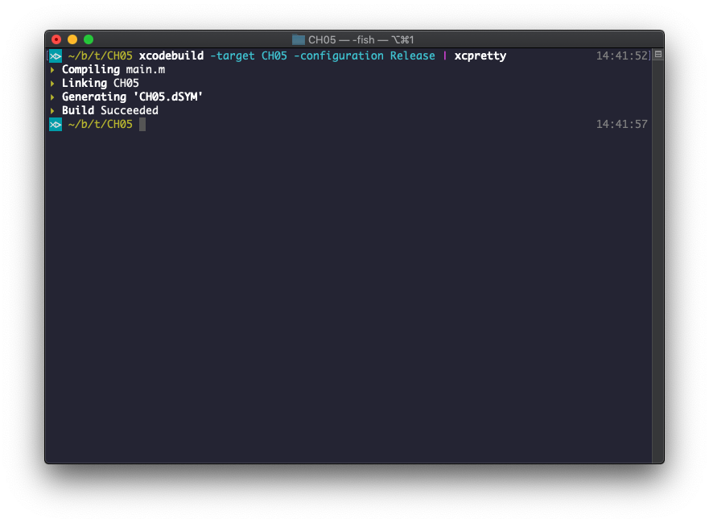

这里我们提另一个命令行工具 xcpretty，它可以帮助我们把 xcodebuild 的输出做格式化，非常好用。因为是 ruby 开发的，我们可以用通过 gem 安装。

```
$ gem install xcpretty # install
$ xcodebuild -target CH05 -configuration Release | xcpretty # usage
```

瞬间，刚才杂乱无章的输出变得极为简洁清爽了。
我们刚才提到了用 scan-build 来针对大型工程的构建过程进行静态分析，做法也非常简单。

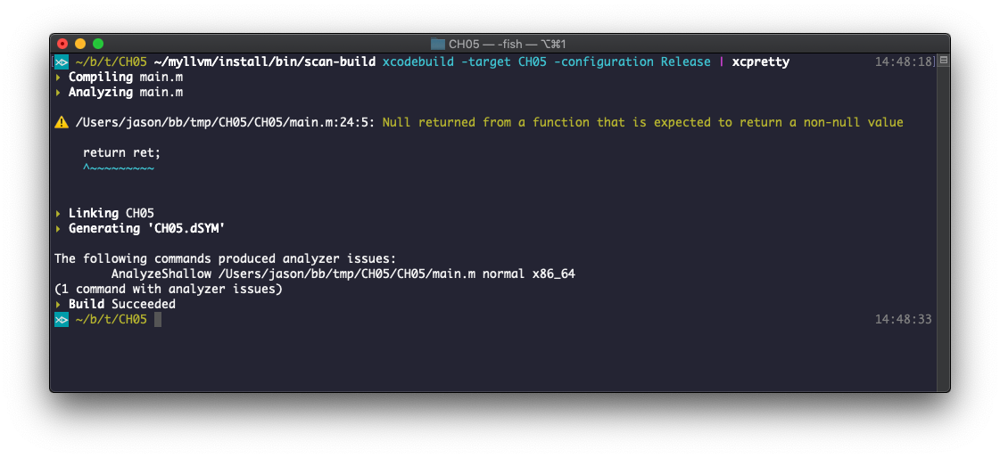

与 clang 类似，scan-build 中也可以指定使用和不使用哪些 checker。

```
$ ~/myllvm/install/bin/scan-build -disable-checker nullability xcodebuild -target CH05 -configuration Release | xcpretty
```

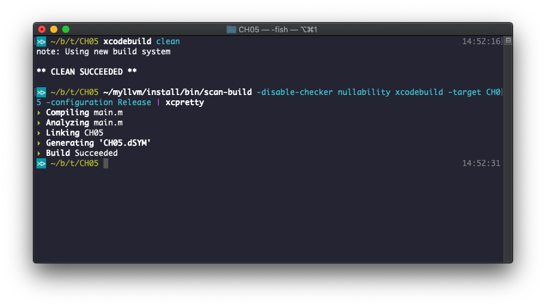

可以看到，我们把 nullability 禁用之后，刚才的警告就消失了。
类似的，scan-build 也可以生成 HTML 格式的分析报告。

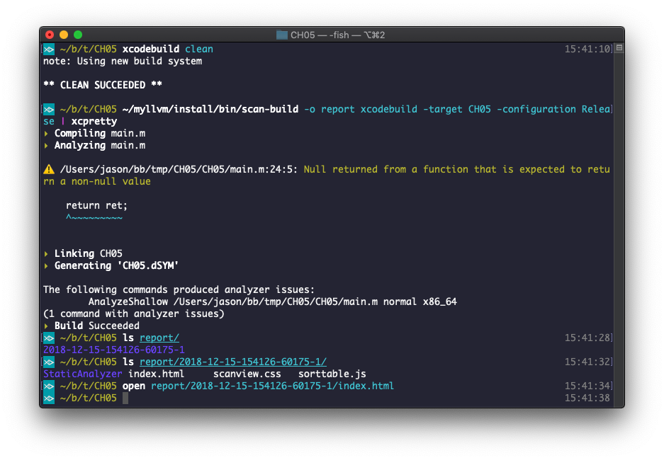

本章完。

