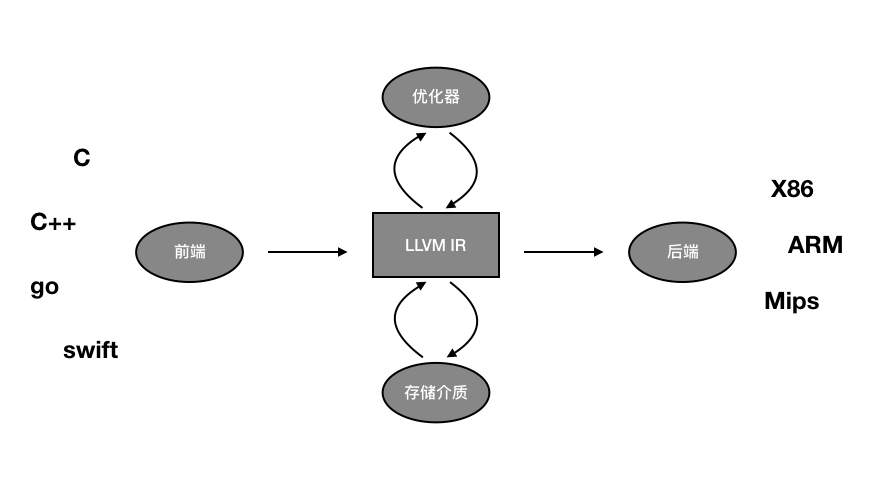
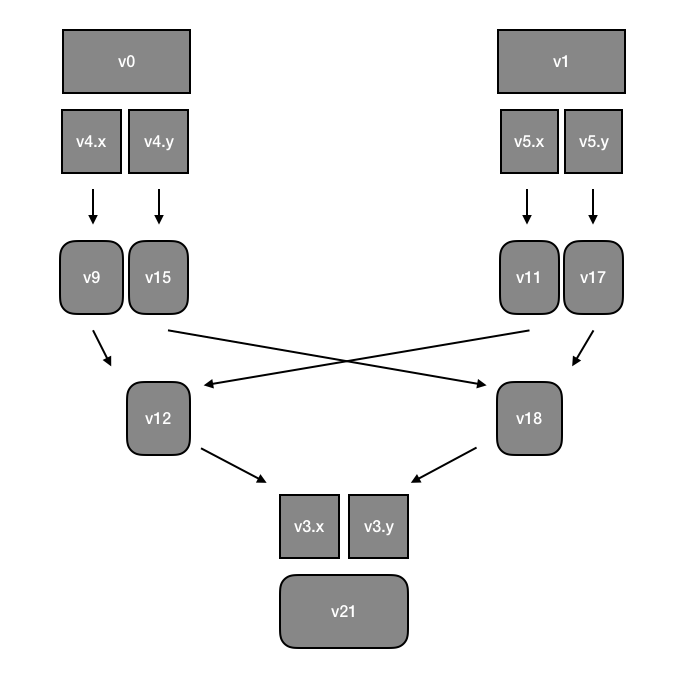

# 第七章 中间表示

中间表示（Intermediate Representation, IR）是编译器设计的核心元素，是连接不同语言的前端和不同架构后端的中间者。可以说 LLVM 核心逻辑就是围绕 IR 展开的，前端负责生产 IR，后端负责消费 IR，就像一种货币一样，前后端不必跟对方的细节打交道。因此 IR 也是 LLVM 可以支持语言和多种架构的基石。

## 理解 IR

LLVM 就像一条流水线，把输入的源代码文件经过一道一道工序处理，最终变成了可执行文件。这些工序之间彼此独立，一个工序做完以后需要把结果交给下一道工序，也就是把输出交给下一道工序作为其输入，我们把这个交出去的东西叫做“转换单元”。但每道工序仅有一个输入和一个输出，因此这个转换单元就需要能够完整的表示所有的信息，并且是能够为各个工序所理解的。就像普通话一样，不能带有太多的方言词汇。IR 也一样，它的定义必须拿捏的恰到好处，不能带有太多的前端特色或者后端特色，否则就很难成就 LLVM 多语言多架构的特性了。因此在 IR 中可以有的元素就很有限，像高级语言中的类的概念就不会存在，但是有函数的存在，因为这是几乎所有编程语言里都存在的。



IR 也可以算是一种编程语言吧，只不过通常不是由人类编写，而是由 LLVM 前端根据不同的源代码生成。不过为了让 LLVM 成为一种通用编译器，LLVM IR 其实可读性还不差，可以以文本或者二进制的形式存储在文件中，其中前者的可读性好，后者的存储和解析效率高。通俗的讲，IR 是一种介于 C 语言和汇编语言之间的一种形式，主要由全局变量、函数、临时变量、指令等构成，数据类型包括基本数据类型、数组、指针、结构体等，更直接的说就是 C语言的类型 + 汇编的指令。

## 借助工具产生和使用 IR

下面我们介绍 LLVM 自带的相关命令。

先来编写一个简单的 C 代码。

```c
int sum(int, int);

int sum(int a, int b)
{
  return a + b;
}
```

然后通过 clang 来把 C 代码编译成 IR 文件。

```bash
clang -emit-llvm sum.c -o sum.bc
```

这样产生的 .bc 是二进制的存在形式，如果要产生文本格式的，通过添加 -S 参数即可，这里的 S 应该是 String 的意思。

```bash
clang -S -emit-llvm sum.c -o sum.ll
```

.bc 和 .ll 两者信息等价，可以通过 llvm-as 和 llvm-dis 相互转换。

```bash
llvm-as sum.ll -o sum.bc
llvm-dis sum.bc -o sum.ll
```

还有一个工具 llvm-extract 可以抽取其中某些函数或者全局变量的定义。

```bash
llvm-extract -func=sum sum.bc -o sum-fn.bc
```

clang 还可以消费 IR 文件，以此完成后续的编译过程。

```bash
clang sum.ll -c -o sum.o
```

## IR 的语法

为了演示 IR 的格式，我们来编写一个稍微复杂的 C 代码。

location.h

```c
struct Location {
  int x;
  int y;
};

extern struct Location sum(struct Location, struct Location);
```

location.c

```c
#include "location.h"

struct Location sum(struct Location a, struct Location b)
{
  struct Location r;
  r.x = a.x + b.x;
  r.y = a.y + b.y;
  return r;
}
```

通过 clang 编译成 IR。

```bash
clang location.c -S -emit-llvm -o location.ll
```

IR 的内容如下：

```as
; ModuleID = 'location.c'
source_filename = "location.c"
target datalayout = "e-m:o-i64:64-f80:128-n8:16:32:64-S128"
target triple = "x86_64-apple-macosx10.14.0"

%struct.Location = type { i32, i32 }

; Function Attrs: noinline nounwind optnone ssp uwtable
define i64 @sum(i64, i64) #0 {
  %3 = alloca %struct.Location, align 4
  %4 = alloca %struct.Location, align 4
  %5 = alloca %struct.Location, align 4
  %6 = bitcast %struct.Location* %4 to i64*
  store i64 %0, i64* %6, align 4
  %7 = bitcast %struct.Location* %5 to i64*
  store i64 %1, i64* %7, align 4
  %8 = getelementptr inbounds %struct.Location, %struct.Location* %4, i32 0, i32 0
  %9 = load i32, i32* %8, align 4
  %10 = getelementptr inbounds %struct.Location, %struct.Location* %5, i32 0, i32 0
  %11 = load i32, i32* %10, align 4
  %12 = add nsw i32 %9, %11
  %13 = getelementptr inbounds %struct.Location, %struct.Location* %3, i32 0, i32 0
  store i32 %12, i32* %13, align 4
  %14 = getelementptr inbounds %struct.Location, %struct.Location* %4, i32 0, i32 1
  %15 = load i32, i32* %14, align 4
  %16 = getelementptr inbounds %struct.Location, %struct.Location* %5, i32 0, i32 1
  %17 = load i32, i32* %16, align 4
  %18 = add nsw i32 %15, %17
  %19 = getelementptr inbounds %struct.Location, %struct.Location* %3, i32 0, i32 1
  store i32 %18, i32* %19, align 4
  %20 = bitcast %struct.Location* %3 to i64*
  %21 = load i64, i64* %20, align 4
  ret i64 %21
}

attributes #0 = { noinline nounwind optnone ssp uwtable "correctly-rounded-divide-sqrt-fp-math"="false" "disable-tail-calls"="false" "less-precise-fpmad"="false" "no-frame-pointer-elim"="true" "no-frame-pointer-elim-non-leaf" "no-infs-fp-math"="false" "no-jump-tables"="false" "no-nans-fp-math"="false" "no-signed-zeros-fp-math"="false" "no-trapping-math"="false" "stack-protector-buffer-size"="8" "target-cpu"="penryn" "target-features"="+cx16,+fxsr,+mmx,+sahf,+sse,+sse2,+sse3,+sse4.1,+ssse3,+x87" "unsafe-fp-math"="false" "use-soft-float"="false" }

!llvm.module.flags = !{!0, !1}
!llvm.ident = !{!2}

!0 = !{i32 1, !"wchar_size", i32 4}
!1 = !{i32 7, !"PIC Level", i32 2}
!2 = !{!"Apple LLVM version 10.0.0 (clang-1000.11.45.5)"}
```

一个 IR 文件也就是一个 LLVM 模块，模块是 IR 的顶级数据结构，模块中通常包含了一系列的函数，函数中包含块（basic block），块中包含一些列指令。模块中通常还包含一些外围支持，例如全局变量、目标数据布局，外部函数原型和数据结构体声明等。

从上到下我们分别来解读 location.ll 文件。

模块头部：

```ruby
; ModuleID = 'location.c'
source_filename = "location.c"
target datalayout = "e-m:o-i64:64-f80:128-n8:16:32:64-S128"
target triple = "x86_64-apple-macosx10.14.0"
```

`;` 是注释内容，通常有助于我们阅读，对后续编译没有实际意义。

`source_filename` 指定了源代码地址，可以辅助定位问题的时候提示错误位置。

`target triple` 指定目标，包含 CPU 架构、电脑厂商、操作系统，`target datalayout` 指定如何在这种特定目标中布局数据。

- 最开头的 `e` 表示小端，而用 `E` 表示大端。
- `m:<mangling>` 定义命名修饰，`o` 表示 Mach-O 格式，私有符号以 `L` 开头，其他符号以 `_` 开头。
- `i<size>:<abi>[:<preferred>]` 表示 位数为 `<size>` 的 `int` 类型的对齐位数，其中 `<abi>` 是最小值，`<preferred>` 是推荐值，通常更大，省略表示与 `<abi>` 相同。所以这里的 `i64:64` 表示64位 int 的对齐位数为64。
- `f<size>:<abi>:<pref>` 与上一条类似，不过这里的80大家可能见的少，通常我们不会用到这么大的浮点型。
- `n<size1>:<size2>:<size3>...` 表示支持的 int 类型。
- `S<size>` 表示栈的对齐位数。


全局声明部分：

```ruby
%struct.Location = type { i32, i32 }
```

定义了一种名为`struct.Location`的数据类型，类型由两个 int32 数据组成，对应于我们 C 代码中的 struct Location 的定义。

函数定义部分：

```as
; Function Attrs: noinline nounwind optnone ssp uwtable
define i64 @sum(i64, i64) #0 {
  %3 = alloca %struct.Location, align 4
  %4 = alloca %struct.Location, align 4
  ...
  
  ret i64 %21
}

attributes #0 = { noinline nounwind ... }
```

这部分看起来有点像 C 函数的定义，这里定义了一个名为 sum 的函数，你可能会好奇，这里的返回值和参数类型为什么不是 %struct.Location，而是 i64。其实类型的定义本质上是用于计算偏移量和数据大小的，而对于数据本身，类型只需要达到相同位数就是等价的，不是吗？

另外你应该注意到，函数名都冠以`@`开头，我们知道就可以了。

最后的部分 `#0` 是属性定义，因为太长，所以这里只用了一个名称，它的完整定义在函数定义的后面，`attributes #0 = { noinline nounwind ... }`，主要是一些指导后端编译过程的信息，比如 noinline 表示不要内连，nounwind 表示不捕获异常等等。

函数体部分：

这部分是函数的实现逻辑，包含了一系列的指令。需要注意的是这里的指令是 LLVM 自己解读的，并不是任意一种 CPU 的汇编指令。而且这些指令看起来很长很臃肿，不像会像指令那样简洁，乍一看过去有一种生理排斥感。不过不用担心，笔者会带领你一点一点地拆解。

**alloca**

```as
%3 = alloca %struct.Location, align 4
```

alloca，就是 alloc address，这里的地址是指栈空间上的地址。IR 指令上无法直接实现类似 C 语言中的 alloc 函数的功能的，它只能直接控制栈空间。这条指令的意义就是声明了一个临时变量 %3，类型是 struct Location，不过特别之处在于 %3 是地址变量而非值变量。align 4 表示的是 %3 在栈上的内存布局。翻译成 C，等价于如下代码：

```c
struct Location v3; // alloca
struct Location *v3a = &v3; // %3
```

**bitcast**

```as
%6 = bitcast %struct.Location* %4 to i64*
```

数据类型转换指令 bitcast，特别之处在于转换过程不会修改 bit 位内容。解释一下，我们在 C 中把一个 float 转换成 int，虽然数据位数相同，转换的结果也近似相等，但实际上计算机会修改 float 值中的 bit 位内容，因为 float 的内存表示和 int 是完全不同的（float 会分出一部分 bit 位来表示科学记数法中的整数部分，另一部分表示2的幂），而且这种转换还是有精度损耗的。相比之下，bitcast 就是把数据以二进制位的形式直接复制，而不考虑源类型和目标类型的差异。翻译成 C，等价于如下代码：

```c
int64 *v6a = (int64 *)v4a;
```

**getelementptr**

```as
%14 = getelementptr inbounds %struct.Location, %struct.Location* %4, i32 0, i32 1
```

getelementptr 获取复杂类型地址的子类型偏移地址，有点拗口，其实简单说就是取结构体指针的变量偏移或者取数组的下标。与之对应的 C 代码如下：

```c
int32 *v14a = &v4a->y;
```

**load**

```as
%15 = load i32, i32* %14, align 4
```

load 指令很简单，相当于 C 中的解引用，或者叫“取地址的值”，与之对应的 C 代码如下：

```c
int32 v15 = *v14a;
int32 *v15a = &v15;
```

**add**

```as
%18 = add nsw i32 %15, %17
```

add 指令也很简单，就是把两个变量的值相加，注意这里有个取值的过程。其实 C 语言中的变量本质都是地址，只不过编译器帮我们自动完成了取值和存值的过程，让我们以为我们好像真的有一个变量，其实任何变量都是以存储介质的形式存在的，通常不是内存就是寄存器。这里又个标记`nsw`，"no signed wrap"，表示该条指令知道自己这个计算不会产生符号溢出问题，用以指导后续编译器优化。等价 C 代码如下：

```c
int32 v18 = *v15a + *v17a;
int32 *v18a = &v18;
```

**store**

```as
store i32 %18, i32* %19, align 4
```

store 指令表示赋值，就是把一个地址的值符给另一个变量，换句话说就是写内存，当然真正编译成机器指令以后可能会被优化成写寄存器。

```c
int32 v19;
int32 *v19a = &v19;
*v19a = *v18a;
```

**ret**

```as
ret i64 %21
```

ret 就是返回指令，函数总是以 ret 指令结尾，如果是 void 类型的函数，其 ret 指令就是 ret void。等价 C 代码如下：

```c
return *v21a;
```

好了，我们一口气解释了 7 条 IR 指令，其他指令都是类似的意思，仅仅是变量名的差别。不过再看这么长的指令集合还是不好理解里面到底做了什么，那么简单的一行 C 代码怎么到了 IR 这里就变得这么长了。我把刚才对应的 C 代码一起写出来做对照，帮助你理解。

```c
struct Location v3, v4, v5;
struct Location *v3a = &v3;
struct Location *v4a = &v4;
struct Location *v5a = &v5;

int64 *v6a = (int64 *)v4a;
*v6a = v0;

int64 *v7a = (int64 *)v5a;
*v7a = v1;

int *v8a = v4a->x;
int v9;
int *v9a = &v9;
*v9a = *v8a;

int *v10a = v5a->x;
int v11;
int *v11a = &v11;
*v11a = *v10a;

int v12;
int *v12a = &v12;
*v12a = v9 + v11;

int *v13a = &v3a->x;
*v13a = v12;

int *v14a = &v4a->y;
int v15;
int *v15a = &v15;
*v15a = *v14a;

int *v16a = &v5a->y;
int v17;
int *v17a = &v17;
*v17a = *v16a;

int v18;
int *v18a = &v18;
*v18a = v15 + v17;

int *v19a = &v3a->y;
*v19a = v18;

int64 *v20a = (int64 *)v3a;

int64 v21;
int64 *v21a = &v21;
*v21a = *v20a;

return v21;
```

不知道你看了以后的感想，总之我翻译完之后感觉更加不能理解了，为了跟上 IR 的思路，我画了一张图来辅助理解。



从图中我们可以看到，其实 IR 的思路是把 v0 和 v1 先拆成两个 int32，然后分别相加，最后再合并到一个 int64 中。不过我们可以发现，这些代码其实很冗余，那为什么 IR 会把如此简单的逻辑搞的如此复杂难懂呢？这就不得不提几个 IR 的特性了。

首先，函数的参数名没有了，代之以 %0 - %n 这样的数字化名称，而类似的，函数中使用的临时变量，名称也是这种数字化的形式。其实这里的变量名只要是以 % 开头的字符串即可，并没有要求一定是数字化的，之所以是我们看到的样子，其实是编译器在偷懒，反正这些变量原本就不是给人看的，保留 C 中原有的变量名一样不大，那为了简化逻辑，就用这种方式岂不是更简单直接吗？

其次，IR 中的指令如此之多，其实是因为变量多导致的。你有没有发现一个规律，就是这些变量从来都只访问过一次，不像我们在 C 代码中，每个变量可能多次读和写，IR 每写一小段逻辑就会换一个新的变量，于是就产生了新的 alloca、load、store 这些一遍又一遍非常冗余的指令。这是一种被称为 SSA 的规则，Static Single Assignment，意思是每个变量只会赋值一次。这种设计思想是为了简化优化器的分析逻辑，因为不必分析这个变量过往的访问历史。另外你可能还发现，IR 的每条指令都很“啰嗦”，每个变量在访问的时候都一定要加上类型，这也是有设计上考量的，因为编译器在把一条 IR 指令翻译成汇编指令的时候，不必往前找这个变量是什么类型，只需要看当前指令可以知道。

最后，我们观察到，每条指令的逻辑都很简单纯粹，这也是导致 IR 的内容很长的原因。因为我们在 C 代码里要做的一件很简单的事，在 IR 往往需要多条指令组合完成。例如 int a = b， 就需要 alloca、load、store 等多条指令的组合才能完成。这种指令我们称为“三地址指令”，就是一条指令最多有三个地址和最多一个运算符组成，比如 add 指令，把两个地址的值相加放到第三个地址里。这与汇编指令不同，汇编指令的运算结果通常是放在运算对象里的，例如 ADD DI, 3，就是把寄存器 DI 的值取出来与 3 相加再返回寄存器 DI。

结尾部分：

```ruby
!llvm.module.flags = !{!0, !1}
!llvm.ident = !{!2}

!0 = !{i32 1, !"wchar_size", i32 4}
!1 = !{i32 7, !"PIC Level", i32 2}
!2 = !{!"Apple LLVM version 10.0.0 (clang-1000.11.45.5)"}
```

这部分是一些其他的模块信息，flags 是两个标志，一个表示字长、一个表示 PIC（动态库的编译参数） 水平。ident 是编译器的签名。

## 优化器

回头看前面 图1 你会发现，在 IR 的上方是优化器，也就是说优化器是基于 IR 实现的，它输入优化前的 IR，输出优化后的 IR，当然理论上要保证前后逻辑等价且效率更高。

优化器由一些列 Pass 组成，每个 Pass 理论上只负责一个独立的优化策略，多个 Pass 像流水线一样依次处理 IR。

根据优化原理的不同，优化器还分编译时优化和链接时优化，分别在不同的时段做优化。这里所说的链接不是`ld` 命令所做的工作，即把多个 .o 文件链接成一个可执行文件，而是把多个 .bc 文件合并成一个 .bc 文件。所以这种链接时优化很多时候不一定会起作用，比如一个大型 C 工程，会先把每个 .c 文件直接编译成对应的 .o 文件，最后执行 ld 链接操作，而跳过了 IR 的链接过程。

优化分为不同的级别，不同的优化级别所使用的 Pass 不同，高级别的优化往往比较激进，有导致程序 bug 的风险。所以往往在实际应用中使用相对保守的策略。指定优化级别是 `-O<N>` 这个参数，`-O0` 是默认值，表示不进行任何优化，通常在调试程序的时候会用。`-O2` 是中度优化水平，会开启大多数优化器，`-O1` 水平更低更保守，Xcode 中的默认选项就是它。`-O3` 接近 `-O2`，区别是包含了一些相对更加消耗编译时间的优化器和为了提升运行效率而产生更大代码的优化器（例如把5次的循环拆成重复的5组指令而免除自增运算）。其他的，`-O4` 会开启链接时优化，`-Os` 会尽量降低代码大小，`-Oz` 相比 `-Os` 进一步降低代码大小。

我们以 sum.c 为例来看一下优化后的结果：

```bash
clang -O2 -S -emit-llvm sum.c -o sum-O2.ll
```

sum-O2.ll

```as
; ModuleID = 'sum.c'
source_filename = "sum.c"
target datalayout = "e-m:o-i64:64-f80:128-n8:16:32:64-S128"
target triple = "x86_64-apple-macosx10.14.0"

; Function Attrs: norecurse nounwind readnone ssp uwtable
define i32 @sum(i32, i32) local_unnamed_addr #0 {
  %3 = add nsw i32 %1, %0
  ret i32 %3
}
...

```

哈哈，前面我们还在吐槽的 IR 多么冗余啰嗦，是不是错怪开发 LLVM 的大神们了！


再来看一下 location.c 优化后的 IR 代码又有什么惊喜呢？

```as
; ModuleID = 'location.c'
source_filename = "location.c"
target datalayout = "e-m:o-i64:64-f80:128-n8:16:32:64-S128"
target triple = "x86_64-apple-macosx10.14.0"

; Function Attrs: norecurse nounwind readnone ssp uwtable
define i64 @sum(i64, i64) local_unnamed_addr #0 {
  %3 = and i64 %0, -4294967296
  %4 = add i64 %1, %0
  %5 = add i64 %3, %1
  %6 = and i64 %5, -4294967296
  %7 = and i64 %4, 4294967295
  %8 = or i64 %6, %7
  ret i64 %8
}

```

看起来有点奇怪，似乎跟我们原本的逻辑相差很大。其实逻辑上是等价的，如果你有兴趣做一个转换就知道，4294967296 对应的64位二进制是 32 个 1 后面跟 32 个 0，而 -4294967296 是 32 个 0 后们跟 32 个 1，所以这段指令集的逻辑是先把结构体中的两个 int32 取出来分别 add，再用 or 运算合起来。
之所以这样，是因为这样可以更少的使用内存，尽量使用寄存器来完成计算，优化器真的很聪明。

## 中间表示的数据结构

前面我们介绍了中间表示可以以文件的形式存储起来，但实际的场景中，编译器很少需要这样做，更多的只是在内存中通过特定的数据结构来表示，通过访问这些数据结构来实现编译过程。对于 IR 的定义相关头文件在 include/llvm/IR 目录中，它们是一系列的 C++ 类，以下我们介绍其中几个最重要的类：

`Module` 类是 IR 的顶级结构，包含了模块中所有的元素，对应一个完整的转换单元或者多个转换单元的合并，通过 Module::iterator 类型来迭代访问其中的每一个函数，迭代的开始和结束分别是 begin() 和 end()。相关的文档可以查看 [http://llvm.org/doxygen/classllvm_1_1Module.html](http://llvm.org/doxygen/classllvm_1_1Module.html)。


`Function` 类包含了一个函数的声明和定义的所有相关对象。函数分为模块自己定义的和模块引用的外部函数，可以通过 `isDeclaration()` 来判定。对于仅有声明的函数，`Function` 中只包含了函数的原型，可以通过 `getName()` 获取名称，通过 `getFunctionType()->getParamType()` 来获取函数的参数类型。也可以通过 `for (Function:arg_iterator i = function.begin(), e = function.end(); i != e; ++i)` 来访问函数每个参数的类型。对于内部定义的函数，可以通过 `getArgumentList()` 或者 `arg_begin()` 和 `arg_end()` 来访问每个参数。相关的文档可以查看 [http://llvm.org/doxygen/classllvm_1_1Function.html](http://llvm.org/doxygen/classllvm_1_1Function.html)。

`BasicBlock` 类包含了一系列 LLVM 指令，比如一个函数的实现部分就是一个 Basic Block，同样的，你可以通过 `begin()` 和 `end()` 来访问这些指令，`getTerminator()` 可以直接获取最后一条指令。相关的文档可以查看 [http://llvm.org/doxygen/classllvm_1_1BasicBlock.html](http://llvm.org/doxygen/classllvm_1_1BasicBlock.html)。

`Instruction` 类是 IR 的基本单元，对应一条运算指令，例如 Add、Call 之类的单条指令。每条指令都有一个操作编码，表示指令的类型，可以通过 `getOpcode()` 获取，是一个枚举类型 `llvm::Instruction`。相关的文档可以查看 [http://llvm.org/doxygen/classllvm_1_1Instruction.html](http://llvm.org/doxygen/classllvm_1_1Instruction.html)。

`User` 和 `Value` 是两个抽象接口，分别表示“使用”和“定义”（或者叫做“被使用”）。比如一个函数即算是“定义”（被别的指令调用）也算是“使用”（使用参数）。`Value` 类定义了 `use_begin()` 和 `use_end()` 两个方法迭代所有的使用者 `User` 对象，`getName()` 可以获取它的名称，例如变量名 %a1、函数名 sum 等。`User` 类定义了 `op_begin()` 和 `op_end()` 两个方法，作用相反，可以迭代使用到的所有 `Value` 对象。你可以想见，`User` 和 `Value` 类似数据库中的多对多关系，通过迭代器可以相互访问。LLVM 还提供了一次性替换所有 Value 的工具方法，replaceAllUsesWith(Value *) 和 replaceAllUsesOfWith(Value *From, Value *To)，用以修改映射关系。这种工具可以方便快速开发优化器。相关的文档可以查看 [http://llvm.org/doxygen/classllvm_1_1User.html](http://llvm.org/doxygen/classllvm_1_1User.html) 和 [http://llvm.org/doxygen/classllvm_1_1Value.html](http://llvm.org/doxygen/classllvm_1_1Value.html)。

## 编写自己的 IR 生成器

我们知道编译器前端，例如 clang、swiftc 的核心工作就是通过对源代码的解析生成 IR，生成 IR 的方法并不是拼凑 .ll 文件的内容，而是通过我们前文介绍的 LLVM 提供的一系列数据结构和函数来构建 IR 的内存表示。通过前文的解读，我们现在可以开发一个简单的代码来替代 sum.c 的编译过程，直接通过 LLVM API 生成 IR 模块了。

要使用 IR 相关的 API，首先需要引入相关的头文件，它们分别是：

```c++
#include <llvm/ADT/SmallVector.h>
#include <llvm/IR/Verifier.h>
#include <llvm/IR/BasicBlock.h>
#include <llvm/IR/Function.h>
#include <llvm/IR/LLVMContext.h>
#include <llvm/IR/Module.h>
#include <llvm/IR/Instruction.h>
#include <llvm/Bitcode/BitcodeReader.h>
#include <llvm/Bitcode/BitcodeWriter.h>
```

在接下来的演示中，我们会主要使用 llvm 的命名空间中的很多类，为了方便后续使用我们先引入 llvm 这个命名空间中的所有符号。

```c++
using namespace llvm;
```

在开发之前，我们先把 sum.c 在不开启优化的情况下编译出的 IR 放出来做参考。

```as
; ModuleID = 'sum.c'
source_filename = "sum.c"
target datalayout = "e-m:o-i64:64-f80:128-n8:16:32:64-S128"
target triple = "x86_64-apple-macosx10.14.0"

; Function Attrs: noinline nounwind optnone ssp uwtable
define i32 @sum(i32, i32) #0 {
  %3 = alloca i32, align 4
  %4 = alloca i32, align 4
  store i32 %0, i32* %3, align 4
  store i32 %1, i32* %4, align 4
  %5 = load i32, i32* %3, align 4
  %6 = load i32, i32* %4, align 4
  %7 = add nsw i32 %5, %6
  ret i32 %7
}

attributes #0 = { noinline nounwind optnone ssp uwtable "correctly-rounded-divide-sqrt-fp-math"="false" "disable-tail-calls"="false" "less-precise-fpmad"="false" "no-frame-pointer-elim"="true" "no-frame-pointer-elim-non-leaf" "no-infs-fp-math"="false" "no-jump-tables"="false" "no-nans-fp-math"="false" "no-signed-zeros-fp-math"="false" "no-trapping-math"="false" "stack-protector-buffer-size"="8" "target-cpu"="penryn" "target-features"="+cx16,+fxsr,+mmx,+sahf,+sse,+sse2,+sse3,+sse4.1,+ssse3,+x87" "unsafe-fp-math"="false" "use-soft-float"="false" }

!llvm.module.flags = !{!0, !1}
!llvm.ident = !{!2}

!0 = !{i32 1, !"wchar_size", i32 4}
!1 = !{i32 7, !"PIC Level", i32 2}
!2 = !{!"Apple LLVM version 10.0.0 (clang-1000.11.45.5)"}
```

现在我们分步骤来开发：

第一步先来定义模块，因为它是顶级数据结构嘛，回顾我们前文的内容，此处需要设定模块头部的几个定义，这些可以通过几个相关的函数来完成，我们只需要把 .ll 文件中的内容拷贝进去即可。

```c++
static Module *makeLLVMModule(LLVMContext &ctx) {
    Module *mod = new Module("sum.c", ctx);
    mod->setDataLayout("e-m:o-i64:64-f80:128-n8:16:32:64-S128");
    mod->setTargetTriple("x86_64-apple-macosx10.14.0");
}
```

定义方法签名：

```c++
SmallVector<Type*, 2> FuncTyArgs;
FuncTyArgs.push_back(IntegerType::get(mod->getContext(),
 32));
FuncTyArgs.push_back(IntegerType::get(mod->getContext(),
 32));
FunctionType *FuncTy = FunctionType::get(
 IntegerType::get(mod->getContext(), 32), // return type
 FuncTyArgs, // arguments
 false); // is variable arguments
```

`SmallVector` 是 LLVM 内部使用的一个类似 std::vector 模版类，你可以看到 LLVM 自己定义了一整套常用数据结构，包括容器、字符串等等，真的是一个大工程。
`FunctionType::get` 构造了一个函数原型，参数分别指定了返回值类型、参数类型和是否可变参数（类似 printf 就是可变参数函数）。
`IntegerType::get` 构造了一个数据类型，其中参数 32 表示这是一个 32 位 int。

有了函数原型还不能完整的声明一个函数，还需要指定函数名和其他编译信息。

```c++
Function *funcSum = Function::Create(
 FuncTy,
 GlobalValue::ExternalLinkage,
 "sum",
 mod);
funcSum->setCallingConv(CallingConv::C);
```

静态函数 `Function::Create` 根据函数原型和其他参数创建了一个具体的函数，其中 `GlobalValue::ExternalLinkage` 表示这个函数可以当作外部函数与其他程序模块链接。`setCallingConv` 设定了这个函数的 calling convention，即在被编译硬件指令的时候如何使用寄存器和栈空间来布局参数以及命名函数符号等，这里使用的是 C 风格的规范。

下面来指定函数的参数名称：

```c++
Function::arg_iterator args = funcSum->arg_begin();
Value *int32_a = args++;
int32_a->setName("a");
Value *int32_b = args++;
int32_b->setName("b");
```

下面需要一个 BasicBlock 来承载函数体内的指令：

```c++
BasicBlock *bb = BasicBlock::Create(mod->getContext(), "entry", funcSum, 0);
```

接下来是最关键的指令定义，参考 sum.ll 的内容，我们需要定义 alloc、load、store 等一系列指令：

```c++
const DataLayout &DL = mod->getDataLayout();
unsigned AddrSpace = DL.getAllocaAddrSpace();
AllocaInst *ptrA = new AllocaInst(IntegerType::get(mod->getContext(), 32), AddrSpace, "a.addr", bb);
ptrA->setAlignment(4);
AllocaInst *ptrB = new AllocaInst(IntegerType::get(mod->getContext(), 32), AddrSpace, "b.addr", bb);
ptrB->setAlignment(4);

StoreInst *st0 = new StoreInst(int32_a, ptrA, false, bb);
st0->setAlignment(4);
StoreInst *st1 = new StoreInst(int32_b, ptrB, false, bb);
st1->setAlignment(4);

LoadInst *ld0 = new LoadInst(ptrA, "", false, bb);
ld0->setAlignment(4);
LoadInst *ld1 = new LoadInst(ptrB, "", false, bb);
ld1->setAlignment(4);
```

最后需要计算结果，并将计算结果返回：

```c++
BinaryOperator *addRes = BinaryOperator::Create(Instruction::Add, ld0, ld1, "add", bb);

ReturnInst::Create(mod->getContext(), addRes, bb);

return mod;
```

`makeLLVMModule` 可以创建一个模块，但是还需要一个 main 函数来执行，并将模块保存到磁盘：

```c++
int main() {
    LLVMContext ctx;
    Module *Mod = makeLLVMModule(ctx);
    verifyModule(*Mod);

    std::error_code EC;
    raw_fd_ostream OS("sum.bc", EC, sys::fs::F_None);
    if (EC)
        return -1;

    WriteBitcodeToFile(*Mod, OS);
    return 0;
}
```

完整的程序放在了本书的代码目录中，请查看 [src/ch07/gen_sum.cpp](src/ch07/gen_sum.cpp)

## 编译 LLVM 独立工具

我们已经编写完了全部的代码，但是这个程序应该如何编译呢？还记得我们在前面的章节中介绍了如何在 Xcode 中开发静态检查器，而且在实际开发规模程序的时候也是推荐用这种方式的。不过我们今天介绍一种更轻量的编译方式，不需要借助 IDE，只用 make 就可以完成编译工作，或许这种方式更加适合我们演示和开发规模很小的独立工具，因为我们只需要使用 LLVM 提供的静态库和头文件，并不需要它的源代码。

我们知道要编译 C++ 程序最重要的是要告诉编译器我们用到的头文件和库在什么位置，但是 LLVM 的库比较多，我们要想凑齐这些编译参数并不容易。为此 LLVM 提供了一个非常实用的命令行工具 `llvm-config`，它会根据自己所在的目录自动帮我们计算出所需的配置。例如：

这里笔者使用通过 brew 安装的 llvm，安装目录可以通过 type 命令查询

```bash
$ type llvm-config
llvm-config is /usr/local/opt/llvm/bin/llvm-config
```

我们使用这个目录下的 llvm-config 计算 cxxflags 就会得到这样的结果

```bash
$ llvm-config --cxxflags
-I/usr/local/Cellar/llvm/7.0.0_1/include  -stdlib=libc++ -fPIC -fvisibility-inlines-hidden -Werror=date-time -Werror=unguarded-availability-new -std=c++11 -Wall -Wextra -Wno-unused-parameter -Wwrite-strings -Wcast-qual -Wmissing-field-initializers -pedantic -Wno-long-long -Wcovered-switch-default -Wno-class-memaccess -Wnon-virtual-dtor -Wdelete-non-virtual-dtor -Wstring-conversion -DNDEBUG   -D__STDC_CONSTANT_MACROS -D__STDC_FORMAT_MACROS -D__STDC_LIMIT_MACROS
```

用来计算库的位置

```bash
$ llvm-config --libs core support
-lLLVMCore -lLLVMBinaryFormat -lLLVMSupport -lLLVMDemangle
```

或者链接所有 LLVM 的库

```bash
$ llvm-config --libs
-lLLVMLTO -lLLVMPasses -lLLVMObjCARCOpts -lLLVMSymbolize -lLLVMDebugInfoPDB -lLLVMDebugInfoDWARF -lLLVMMIRParser -lLLVMFuzzMutate -lLLVMCoverage -lLLVMTableGen -lLLVMDlltoolDriver -lLLVMOrcJIT -lLLVMXCoreDisassembler -lLLVMXCoreCodeGen -lLLVMXCoreDesc -lLLVMXCoreInfo -lLLVMXCoreAsmPrinter -lLLVMSystemZDisassembler -lLLVMSystemZCodeGen -lLLVMSystemZAsmParser -lLLVMSystemZDesc -lLLVMSystemZInfo -lLLVMSystemZAsmPrinter -lLLVMSparcDisassembler -lLLVMSparcCodeGen -lLLVMSparcAsmParser -lLLVMSparcDesc -lLLVMSparcInfo -lLLVMSparcAsmPrinter -lLLVMPowerPCDisassembler -lLLVMPowerPCCodeGen -lLLVMPowerPCAsmParser -lLLVMPowerPCDesc -lLLVMPowerPCInfo -lLLVMPowerPCAsmPrinter -lLLVMNVPTXCodeGen -lLLVMNVPTXDesc -lLLVMNVPTXInfo -lLLVMNVPTXAsmPrinter -lLLVMMSP430CodeGen -lLLVMMSP430Desc -lLLVMMSP430Info -lLLVMMSP430AsmPrinter -lLLVMMipsDisassembler -lLLVMMipsCodeGen -lLLVMMipsAsmParser -lLLVMMipsDesc -lLLVMMipsInfo -lLLVMMipsAsmPrinter -lLLVMLanaiDisassembler -lLLVMLanaiCodeGen -lLLVMLanaiAsmParser -lLLVMLanaiDesc -lLLVMLanaiAsmPrinter -lLLVMLanaiInfo -lLLVMHexagonDisassembler -lLLVMHexagonCodeGen -lLLVMHexagonAsmParser -lLLVMHexagonDesc -lLLVMHexagonInfo -lLLVMBPFDisassembler -lLLVMBPFCodeGen -lLLVMBPFAsmParser -lLLVMBPFDesc -lLLVMBPFInfo -lLLVMBPFAsmPrinter -lLLVMARMDisassembler -lLLVMARMCodeGen -lLLVMARMAsmParser -lLLVMARMDesc -lLLVMARMInfo -lLLVMARMAsmPrinter -lLLVMARMUtils -lLLVMAMDGPUDisassembler -lLLVMAMDGPUCodeGen -lLLVMAMDGPUAsmParser -lLLVMAMDGPUDesc -lLLVMAMDGPUInfo -lLLVMAMDGPUAsmPrinter -lLLVMAMDGPUUtils -lLLVMAArch64Disassembler -lLLVMAArch64CodeGen -lLLVMAArch64AsmParser -lLLVMAArch64Desc -lLLVMAArch64Info -lLLVMAArch64AsmPrinter -lLLVMAArch64Utils -lLLVMObjectYAML -lLLVMLibDriver -lLLVMOption -lLLVMWindowsManifest -lLLVMX86Disassembler -lLLVMX86AsmParser -lLLVMX86CodeGen -lLLVMGlobalISel -lLLVMSelectionDAG -lLLVMAsmPrinter -lLLVMX86Desc -lLLVMMCDisassembler -lLLVMX86Info -lLLVMX86AsmPrinter -lLLVMX86Utils -lLLVMMCJIT -lLLVMLineEditor -lLLVMInterpreter -lLLVMExecutionEngine -lLLVMRuntimeDyld -lLLVMCodeGen -lLLVMTarget -lLLVMCoroutines -lLLVMipo -lLLVMInstrumentation -lLLVMVectorize -lLLVMScalarOpts -lLLVMLinker -lLLVMIRReader -lLLVMAsmParser -lLLVMInstCombine -lLLVMBitWriter -lLLVMAggressiveInstCombine -lLLVMTransformUtils -lLLVMAnalysis -lLLVMProfileData -lLLVMObject -lLLVMMCParser -lLLVMMC -lLLVMDebugInfoCodeView -lLLVMDebugInfoMSF -lLLVMBitReader -lLLVMCore -lLLVMBinaryFormat -lLLVMSupport -lLLVMDemangle
```

还可以计算系统库

```bash
$ llvm-config --system-libs
-lz -lcurses -lm -lxml2
```

有了这个工具，我们编写 Makefile 就非常简单了：

```Makefile
LLVM_CONFIG?=llvm-config

ifndef VERBOSE
	QUIET:=@
endif

SRC_DIR?=$(PWD)
LDFLAGS+=$(shell $(LLVM_CONFIG) --ldflags)
COMMON_FLAGS=-Wall -Wextra
CXXFLAGS+=$(COMMON_FLAGS) $(shell $(LLVM_CONFIG) --cxxflags)
CPPFLAGS+=$(shell $(LLVM_CONFIG) --cppflags) -I$(SRC_DIR)

GENSUM=gen_sum
GENSUM_OBJECTS=gen_sum.o

default: $(GENSUM)

%.o : $(SRC_DIR)/%.cpp
	@echo Compiling $*.cpp
	$(QUIET)$(CXX) -c $(CPPFLAGS) $(CXXFLAGS) $<

$(GENSUM) : $(GENSUM_OBJECTS)
	@echo Linking $@
	$(QUIET)$(CXX) -o $@ $(CXXFLAGS) $(LDFLAGS) $^ `$(LLVM_CONFIG) --libs bitreader bitwriter core support --system-libs`
```

Makefile 的代码保存在了源代码目录 [src/ch07/Makefile](src/ch07/Makefile)

下面就可以通过 make 来编译我们的小工具了，这个生成器代码是基于当前最新的 Release 版本 7.0.0 开发的，随着 LLVM 的版本迭代，也许你会遇到编译错误。如果遭遇这种情况，请你查阅 LLVM 的文档或者源代码，从中找到修改的方法，尤其是参考源代码中的测试用例，这样可能更加快捷有效，这对于理解 API 的使用非常有帮助。

```bash
$ make && ./gen_sum && llvm-dis sum.bc && cat sum.ll
; ModuleID = 'sum.bc'
source_filename = "sum.c"
target datalayout = "e-m:o-i64:64-f80:128-n8:16:32:64-S128"
target triple = "x86_64-apple-macosx10.14.0"

define i32 @sum(i32 %a, i32 %b) {
entry:
  %a.addr = alloca i32, align 4
  %b.addr = alloca i32, align 4
  store i32 %a, i32* %a.addr, align 4
  store i32 %b, i32* %b.addr, align 4
  %0 = load i32, i32* %a.addr, align 4
  %1 = load i32, i32* %b.addr, align 4
  %add = add i32 %0, %1
  ret i32 %add
}
```

为了检验我们手工生成的 bitcode 是否可用，我们编写一个测试程序来调用试试看：

```c
#include <stdio.h>

int sum(int, int);

int main()
{
  printf("sum(20, 22) = %d", sum(20, 22));
  return 0;
}
```

然后通过 clang 直接把 .c 文件和 .bc 文件混在一起编译：

```bash
$ xcrun clang test_sum.c sum.bc -o test_sum
$ ./test_sum
sum(20, 22) = 42
```

注：这里用的 clang 是 macOS 下的 brew 安装的，它不能很好的找到系统头文件和库，使用 xcrun 有类似 llvm-config 的作用，可以帮 clang 补充所需的参数，如果读者使用的是其他系统可能没有这个问题。


## 总结

本章我们介绍了 LLVM IR 在编译器中的作用，并以一个 sum 程序为例介绍了 IR 的语法结构，最后通过编写一个 IR 生成器带你认识了相关数据结构和 API，过程中还顺带介绍了使用 Makefile 编译 LLVM 独立工具的方法。


本章完。


